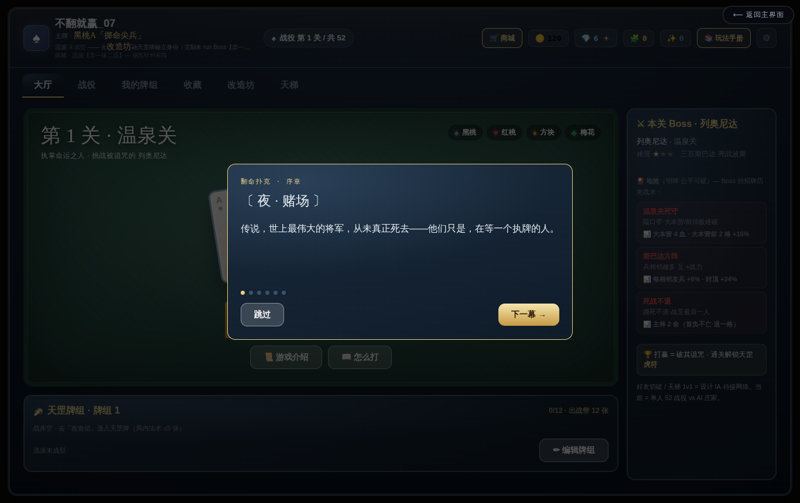
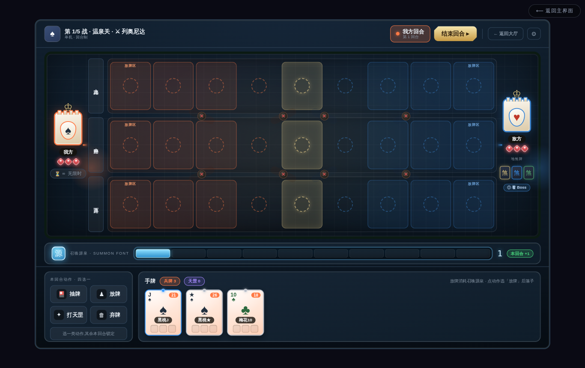
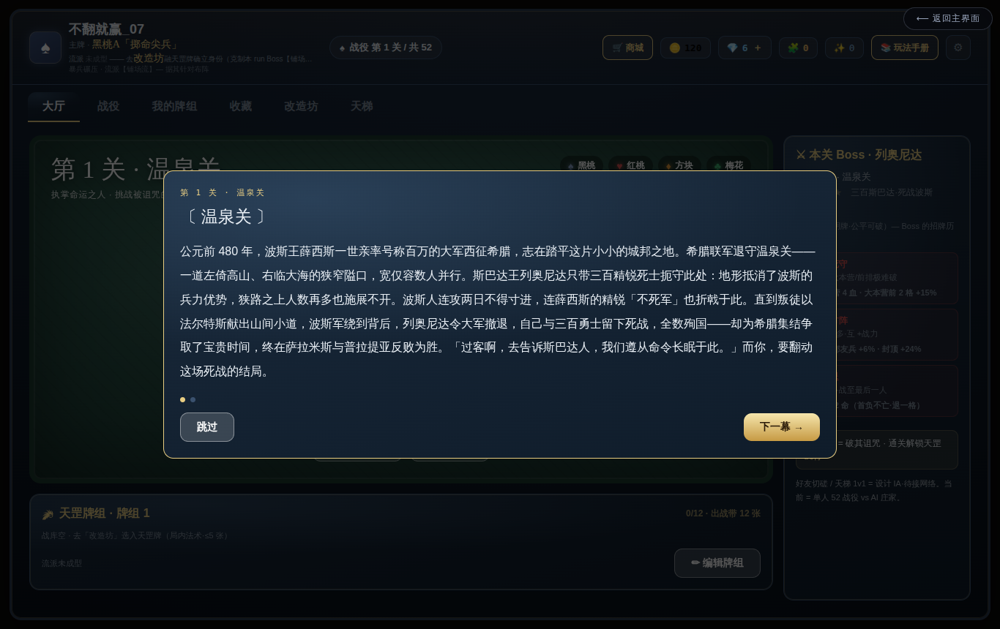
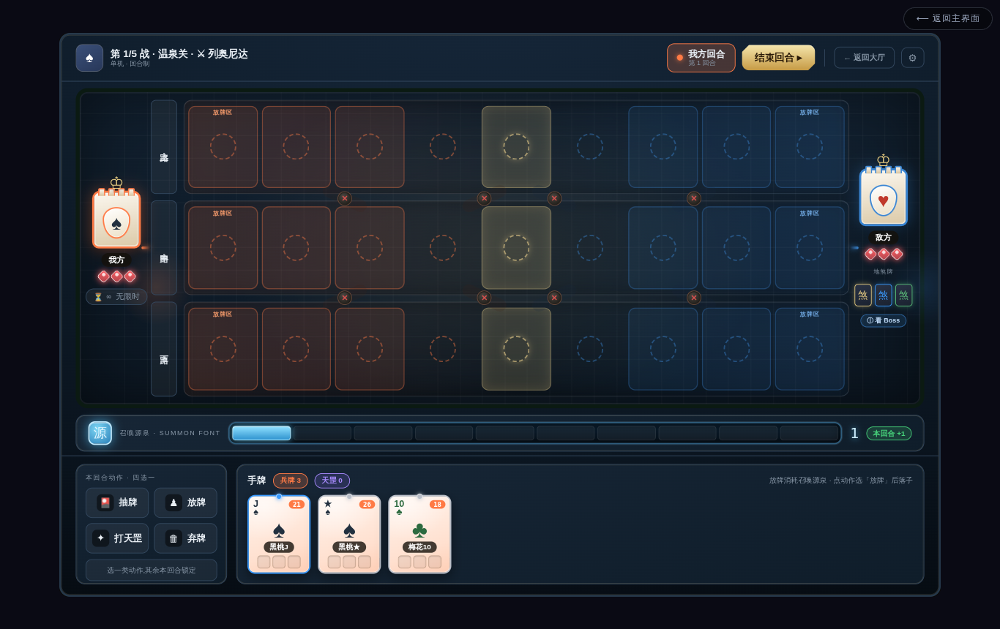
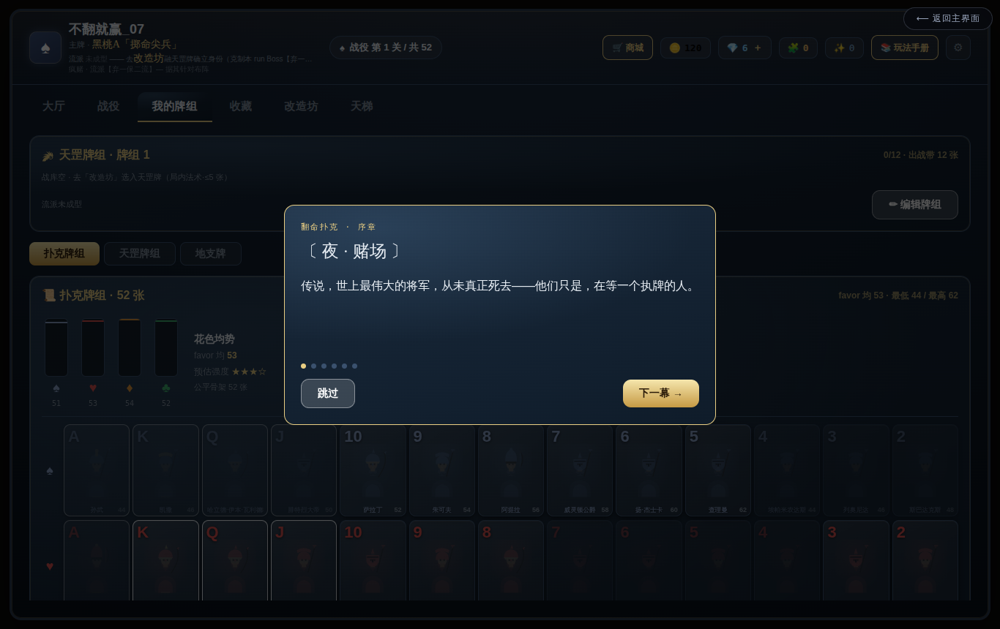
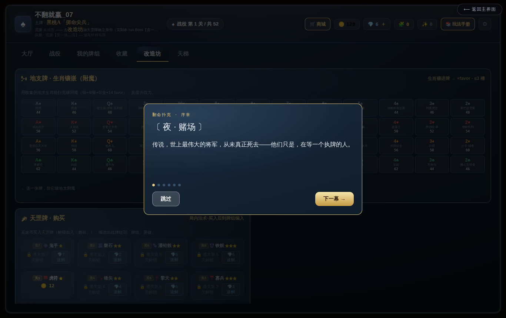
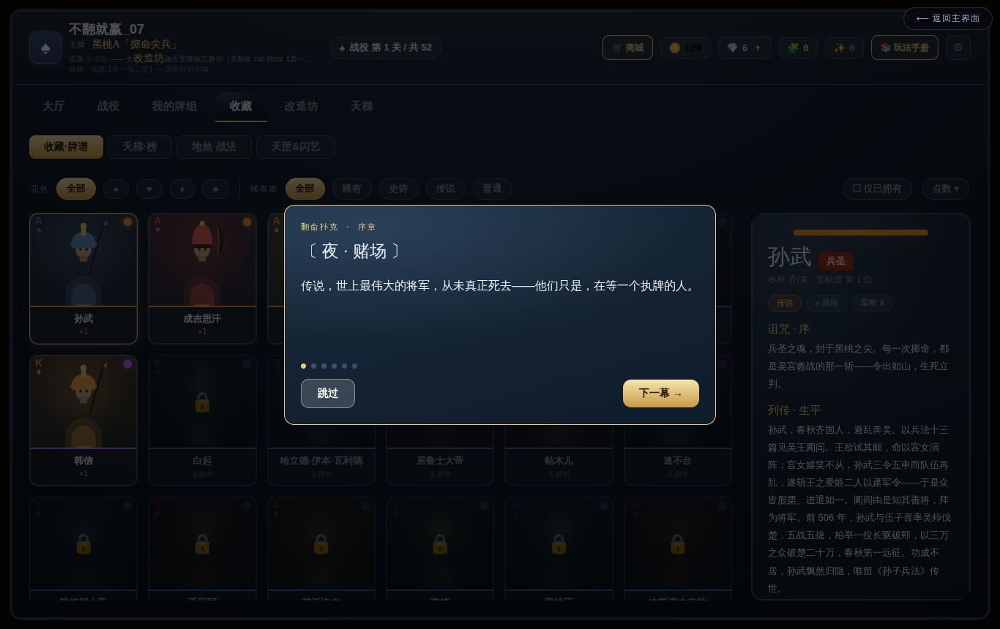
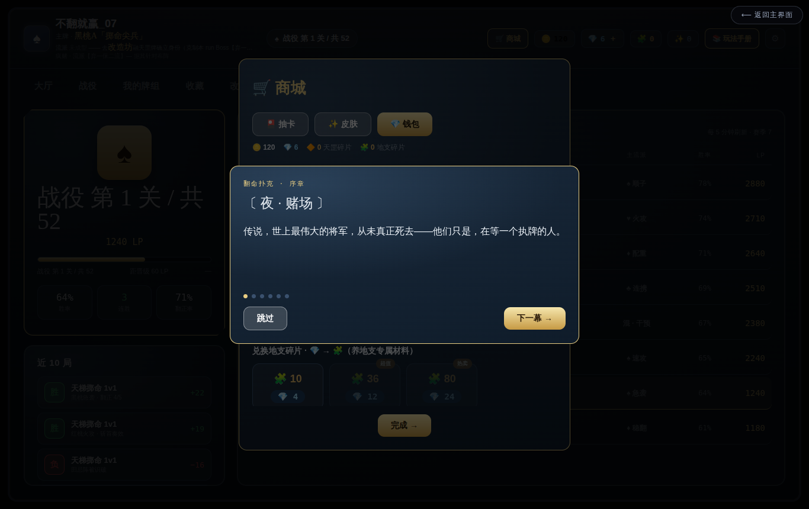
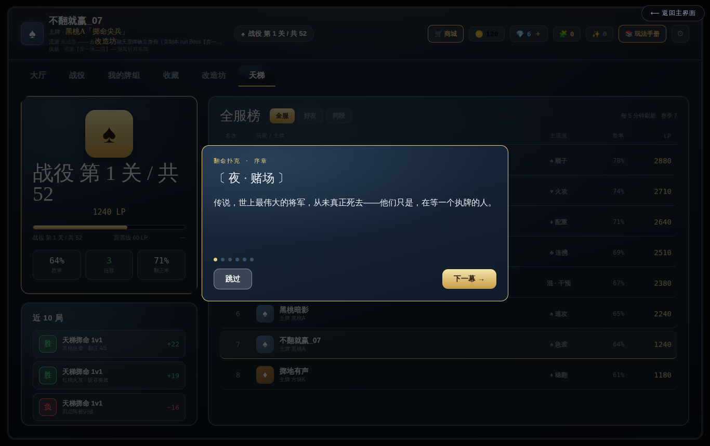

# 《翻命扑克 · Fateflip》· 全游戏总说明（团队总览 v2）

> game design G ｜ 2026-06-21 ｜ **给全团队的单一总览**：读完就懂"这游戏是什么、怎么玩、一局怎么打、怎么构成"。
> 配图为容器内真机截图（`overview-shots/`，已跳过新手引导覆盖层）。详规以各正典为准（doc14/19/20/22/23/24/25/26/27/28）。

---

## 0. 一句话

**《翻命扑克 Fateflip》= 单机 · 回合制 · 卡牌策略（deck-builder）。** 史上 52 位名将的魂被封进一副扑克，你是「执掌命运之人」，配一副牌、闯 52 场命运之战，用「掷命（正面活/反面亡）」**翻命**，解封英雄、越战越强，终章掀翻命运庄家大王/小王。

---

## 1. 世界观

赌场误触一枚黄铜开关 → 史上最伟大的 **52 位名将**（孙武、成吉思汗、亚历山大、项羽…）魂魄被封入一副扑克，各自困在一生最关键的那场战役里。你无意成了执牌人，**重打这 52 场命运之战 = 翻动他们的命**；终局对决坐庄的**大王 / 小王**（54 整副 = 52 名将 + 2 王）。

> 铁律：**英雄 = 叙事/皮肤层，不进对战强度**（公平骨架）；0 篇文案也能跑、逐期解封。

---

## 2. 核心循环



```
配牌组(自选 13 扑克 + ≤5 天罡 + 镶地支)
   → 选关出征(52 场命运之战·每关一位被诅咒名将)
   → 关卡开场剧情(战役背景 + Boss 台词 + 明牌看 Boss 地煞)
   → 回合制战斗：每回合 +1 召唤源泉 · 四选一 · 推进一格 · 遭遇掷命
   → 破敌大本营血 = 胜 → 解封英雄 + 金币 + 掉地支
   → 改造坊成长(养英雄/附魔/构筑天罡/镶地支) + 商城抽卡
   → 打下一关，难度沿英雄贡献度爬向孙武终章
```

---

## 3. ⭐ 一局怎么打（战斗逐步流程）

> 这一节是**最重要的**：一场对局从头到尾、你做什么、敌人怎么选、最后怎么赢。

### 3.0 战场长什么样


- **三条横路**（上/中/下），每路 **9 格**：你方 4 格 · 中间 1 格 · 敌方 4 格。
- 两端是**大本营**（你 ♠ / 敌 ♥），各 **3 点血**（个别 Boss 更厚，如列奥尼达温泉关 4 血）。
- 顶部敌方亮着 **3 张地煞牌**（Boss 招牌战术·明牌）。

### 3.1 赛前（出征 → 看牌）


1. 选关**出征** → 播**关卡开场剧情**（该名将的成名战役背景 + Boss 开场台词）。
2. **明牌看 Boss 的 3 张地煞**（例：列奥尼达「温泉关死守 = 大本营 4 血 + 隘口 +15% 胜率」「斯巴达方阵 = 相邻兵互加战力」「死战不退 = 主将濒死不亡」）。**明牌可破** → 据此心里有数 / counter-pick 天罡。

### 3.2 开局（init）
- 三路 ×9 空格；双方大本营满血；**你起手摸若干张**（手牌混编：扑克兵 + 天罡法术）；**你先手**，回合开始 **+1 召唤源泉**。

### 3.3 你的回合（每回合 +1 源泉 · 四选一互斥）


1. **看局面**：三路态势、敌我最前牌、谁快接敌。
2. **选一类动作**（选了就专心这类·同类可多次·受源泉限）：
   | 动作 | 干什么 · 何时用 |
   |---|---|
   | **放牌** | 把扑克兵摆某路（**费用按点数**：2-4 免费 / 5-7=1 / 8-10=2 / J·Q·K·A=3）。低费牌开局先**铺场、占路、凑连携**；放牌还能顺手**开/关捷径门**调兵换路。 |
   | **抽牌** | 花源泉抽（你选「扑克兵」或「天罡」）——手不够牌时补。 |
   | **打天罡** | 放一张法术，**立即生效、持续整局**（虎符全军+2 / 疾行一路加速 / 擒王斩敌主将令该路溃散…）。卡时机用。 |
   | **弃牌** | 免费丢牌腾手。 |
3. **结束回合** → 棋盘**推进一格**：场上的兵沿路前进一步。

### 3.4 敌人的回合（Boss AI 怎么选）
- Boss 同样 **+1 源泉**，由**一个通用 utility AI** 按它的**性格画像**给每个可选动作打分、选最高分：
  - `aggression` 高 → 爱铺兵前压；`lanePref` → 偏重某路；`spellEager` → 爱放地煞/天罡；`targetPref` → 专挑你最弱/最强/主将；`risk`/`economy` → 冒进还是囤积。
  - **难度档 `aiTier`** 决定它多聪明：低档会犯错（好赢）、高档步步最优。
- **例·列奥尼达（守家硬汉）**：低 aggression + 高 economy → **囤兵守隘口**、不浪推；靠地煞「温泉关死守」把家垒到 4 血、「斯巴达方阵」让抱团兵越站越强。

### 3.5 遭遇 → 掷命对决（核心）
- 两军最前牌在格里**相邻** → 触发**掷命**：
  1. 比双方**战力 P**（基础点数 + 连携 + 天罡 + 士气 + 地煞，各有上限）。
  2. `胜率 = clamp( logistic((P我 − P敌)/k), 3%, 97% )`——战力差越大越碾压，但**永留 3% 爆冷缝**。
  3. **抛牌（种子骰）定生死**：正面方**活·继续前进·续航 −1**；反面方**亡·退场**。
- **续航**：一张牌只能连扛几场掷命，打累了退场冷却 → 逼你**一波波接力、轮换牌组**，神牌也不能包打。
- 遭遇前你可**打天罡 / 调门**改写这一场（这就是干预窗口）。

### 3.6 推进破家 → 胜负
- 你的兵突破敌方 4 格、抵达**敌大本营** → **扣 1 血**；连推、把对面血打光 = **你赢**。
- 反之敌兵破光你 3 血 = **你败**（扣命/run）。

### 3.7 怎么"击败"列奥尼达（一个示例打法）
> 他家厚（4 血 + 隘口加成）、方阵抱团强 → **别正面硬送**。
- 用便宜**低费牌铺三路**、凑**同点/同花连携**把战力堆过他的方阵；
- **疾行**加速一路抢先接敌、**擒王**斩他主将让那路**溃散**打开缺口；
- 两路佯攻牵制、**集中一路突破隘口**；耗他续航、抓爆冷缝。
- 把他 **4 血大本营**打光 → **翻命成功、解封列奥尼达入麾下**。

### 3.8 结算
- 胜 → **解封该英雄** + 金币 + **掉地支（「揉」加权掉落）** → 回大厅成长 → 打下一关。

> **outcome-first（给程序）**：胜负在 build 时由确定性数据（战力规则 + 种子）定，3D/2D 演出是反推的表现、**不回灌、不进 hash** → 跨端一致、多人安全。

---

## 4. 牌组构筑（带谁不带谁 = 策略）



- **出战牌组 = 自选 13 张扑克英雄 + 5 张天罡**（从 52 收藏池挑·养/附魔最好的人带上去）。
- **一键自动构筑**：帮你配一副均衡的（费用曲线铺开·不全大点·尽量凑连携）。
- **13 槽很挤**，要平衡：**费用曲线**（够便宜牌开局铺场）+ **连携**（同点/同花）+ **养成**（镶地支/附魔的核心牌）。
- 为什么不只带每档最高点？**同花线只能用不同点数的同花牌拼**（52 池每点-花仅一张）+ 曲线逼带低牌 + 养成让具体牌更强 → 杂牌都有位置。

---

## 5. 三牌组（独立 · 不融合）

| 牌组 | 数量 | 角色 |
|---|---|---|
| **扑克** | 52（名将）| 上场打的兵。点数=军衔(战力)·花色=阵营。双方点数公平、强弱靠经营。**= 收藏池**，打关解锁。 |
| **天罡** | 36（兵法/法术）| 赛前选 ≤5 带上场（招牌套路）。局内打出立即生效。10 维度：点数/概率/成组/将领/行军/续航/抽牌/三路/攻守/流派印。 |
| **地支** | 12（天命/养成）| 局外镶到英雄牌上（每张 ≤3 颗）。三合/六合连携质变。打局「揉」掉落 + 同生肖合成升档（铜→银→金）。 |

---

## 6. 成长 · 养成



- **改造坊三区**：扑克（养英雄/附魔）· 天罡（构筑战库 ≤5）· 地支（镶嵌/合成）。
- **流派印记**：集齐某流派天罡 → 解锁招牌印·质变（斩首/将领/铺场/弃一保二/同rank/概率 六流派）。
- **公平不氪**：扑克双方同起点，强弱全靠**构筑 + 养成 + 操作**。



- **收藏 / 英雄谱**：52 名将逐关解封；点牌背看**列传**（叙事·世界观·不进强度）。**地煞图鉴 156 张**（Boss 招牌战术·明牌可破）。

---

## 7. 经济（金币 / 钻石 / 商城）



- **金币**：打战斗赚（免费）→ 解锁天罡/地支、改造坊升级。
- **钻石**：付费（**只加速不卖强度**·单机无 PvP 不破平衡）。
- **商城**：抽卡枢纽（天罡+地支·重复转碎片定向兑换·保底可控 build）。**首充免密送钻石+金币**（Demo 友好）。
- **天罡解锁** = 9 关 × 4 = 36（简单→复杂）；前 5 关可反复刷。

---

## 8. 关卡 / Boss（52 命运之战）



- **52 关 = 52 英雄的成名之战**（井陉/坎尼/温泉关/赤壁…）。打赢 = 解封该英雄 + 天罡/地支/金币。
- **难度脊 = 贡献度排名**：关 6=#52 易 → 关 52=#1 孙武终章。sim 调每关目标胜率（早 ~68% → 终章 ~40%）。
- **Boss 非对称**：牌库 = 12 随机天罡 + **3 专属地煞** = 15 张，比你猛。**每关开局明牌亮地煞** → counter-pick 可破。
- **Boss AI** = 一个通用 utility 解释器 + 每 Boss 一份性格画像（aiProfile）+ 难度档（aiTier）·零 per-boss 代码·可仿真。
- **终章**：大王/小王（关 53-54·命运庄家·后续单独设计）。

---

## 9. 新手引导

- **首启**：开场故事（赌场→封印→召唤玩家）→ 强制新人引导（翻玩法手册 → 教学关）→ **教学关**（逐步强制教 放牌/推进/掷命/打天罡/破家）→ 领赠送货币去商城抽一发 → 进关 1。
- **引擎通用 coachmark 能力**：首次用某功能即**高亮该框 + 一句话气泡**指示点哪里、看过不再弹。数据驱动、任何游戏复用。

---

## 10. 工程 / 架构原则（给程序）

- **数据驱动宪法**：整个游戏 = 数据；代码只属于引擎那台固定确定性解释器。先重组现有能力，真缺口才下沉成通用 capability。
- **outcome-first**：胜负 = 确定性整数（规则+种子），表现层单向反推、不进 hash、不回灌 → 跨端浮点不影响胜负、多人安全。
- **单一真相**：数值全在 `doc14`；战斗模型 `doc19/24`；牌组/三牌组 `doc20`；关卡/Boss `doc23/27`。改平衡只动数据、不动逻辑。

---

## 11. 现状（2026-06-21）

- **可玩**：回合制战斗 + 大厅五屏 + 货币/商城 + 关 1-5（含地煞/Boss AI）+ 程序化立绘 + BGM。容器内真机可跑、零 console 报错。
- **设计已定 / 甲乙待实装**：13+5 牌组构筑 + 一键自动构筑 + 放牌 4 档费用 + 基础连携（同点/同花）+ 关 6-52 地煞数据形（141 张全产出）+ 新手引导 coachmark 接入（接入清单见 `DEV-CHECKLIST-*.md`）。
- **待设计**：终章大王/小王、关 6-52 逐关 sim 调值、英雄列传余篇。

> 复诵：**带谁打、怎么构筑、看 Boss 地煞 counter-pick、掌控三路节奏与续航——深度在赛前牌桌与每回合的抉择，不在手速。**
