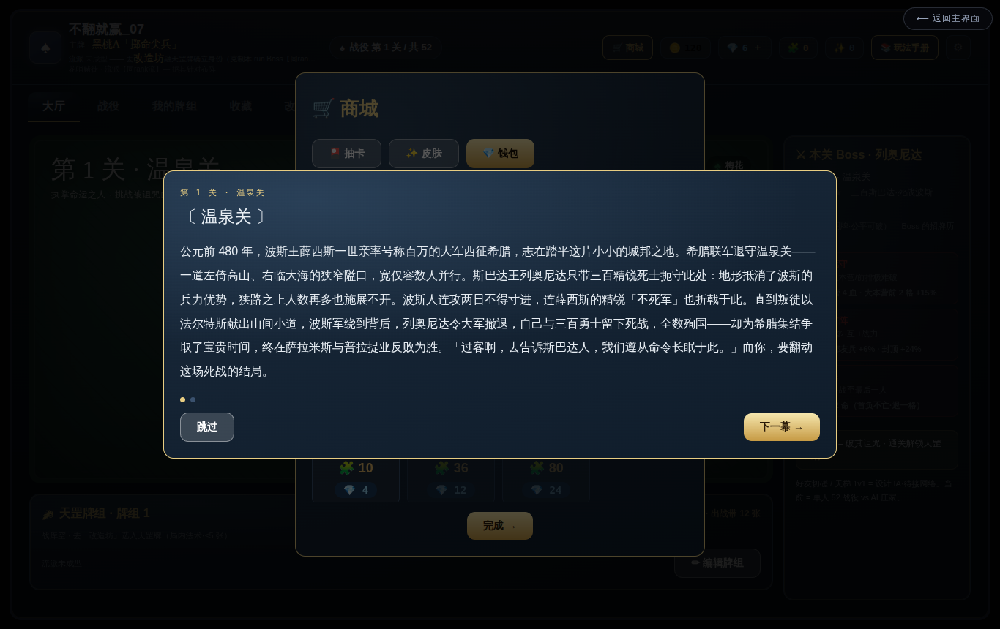
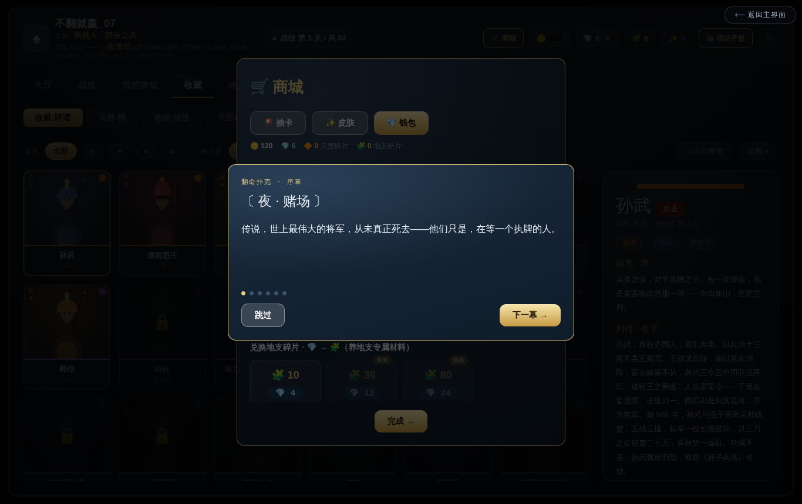

# 《翻命扑克 · Fateflip》· 全游戏总说明（团队总览）

> game design G ｜ 2026-06-21 ｜ **给全团队的单一总览**：一份读完就懂"这游戏是什么、怎么玩、怎么构成"。
> 配图为容器内真机截图（`overview-shots/`）。详规以各正典为准（doc19/20/22/23/24/25/26/27/28 + doc14 数值）。

---

## 0. 一句话

**《翻命扑克 Fateflip》= 单机 · 回合制 · 卡牌策略（deck-builder）。** 历史 52 位名将的魂被封进一副扑克，你是「执掌命运之人」，配一副牌、闯 52 场命运之战，用「掷命（正面活/反面亡）」**翻命**，解封英雄、越战越强，终章掀翻命运庄家大王/小王。

---

## 1. 世界观

赌场误触一枚黄铜开关 → 史上最伟大的 **52 位名将**（孙武、成吉思汗、亚历山大、项羽…）魂魄被封入一副扑克，各自困在一生最关键的那场战役里。你无意间成了执牌人，**重打这 52 场命运之战 = 翻动他们的命**；终局对决坐庄的**大王 / 小王**（54 整副 = 52 名将 + 2 王）。

> 设计铁律：**英雄 = 叙事/皮肤层，不进对战强度**（公平骨架）；0 篇文案也能跑、逐期解封。

---

## 2. 核心循环（大厅 → 战斗 → 成长）


```
配牌组(自选 13 扑克 + ≤5 天罡 + 镶地支)
   → 进关(52 场命运之战·每关一位被诅咒名将)
   → 回合制战斗：每回合 +1 召唤源泉 · 四选一 · 走一格 · 遭遇掷命
   → 破敌 3 血大本营 = 胜 → 解封英雄 + 赚金币
   → 解锁更多天罡 / 养地支 / 改造牌组
   → 打下一关，难度沿英雄贡献度爬向孙武终章
```

---

## 3. 战斗系统（回合制 · doc24/19）



- **战场**：三条横路（上/中/下），每路 **9 格**（你 4 · 中 1 · 敌 4）；两端**大本营各 3 血**，**先破对面 3 血 = 胜**。
- **回合**：每回合开始 **+1 召唤源泉**（行动资源·紧经济），然后**四选一互斥动作**（选一类、同类可多次）：
| 动作 | 说明 |
|---|---|
| 抽牌 | 花源泉抽（选「扑克兵」或「天罡法术」）|
| 放牌 | 把扑克兵摆上一路（**按点数收费**，见下）+ 可顺手开/关捷径门 |
| 打天罡 | 放一张法术（立即生效·持续整局）|
| 弃牌 | 腾手（免费）|
- 做完 → **棋盘走一格**，两军格里碰头 → **掷命对决**。
- **掷命对决（核心）**：比双方**战力 P** → `胜率 = clamp(logistic((P我−P敌)/k), 3%, 97%)` → 抛牌定生死（**正面活·前进 / 反面亡·退场**）。战力决定大势，但**永留 3% 爆冷缝**（赌感 + 防死局）。
- **放牌费用（4 档·让低牌有价值）**：点 **2-4 = 免费** / **5-7 = 1** / **8-10 = 2** / **J·Q·K·A = 3**。低牌便宜=开局铺场弹药，高牌贵=单路决胜。
- **基础连携（一条路内·自动亮线）**：① **同点数**对子/三条 ② **同花色**同花线 → 加战力。天罡（双锋/鼎立/同花魁）在此之上放大。
- **outcome-first**：胜负在 build 时由确定性数据定，3D/2D 演出是反推的表现、不回灌、不进 hash → 跨端一致、多人安全。

---

## 4. 牌组构筑（带谁不带谁 = 策略）


- **出战牌组 = 自选 13 张扑克英雄 + 5 张天罡**（从 52 收藏池挑·养/附魔最好的人带上去）。
- **一键自动构筑**：帮你配一副均衡的（费用曲线铺开·不全大点·尽量凑连携）。
- **13 槽很挤**，要平衡三件事：**费用曲线**（够便宜牌开局）+ **连携**（同点/同花）+ **养成**（镶地支/附魔的核心牌）。
- 为什么不只带每档最高点？因为**同花线只能用不同点数的同花牌拼**（52 池每点-花仅一张）+ 曲线逼带低牌 + 养成让具体牌更强 → 杂牌都有位置。

---

## 5. 三牌组（独立·不融合）

| 牌组 | 数量 | 角色 |
|---|---|---|
| **扑克** | 52（名将）| 上场打的兵。点数=军衔(战力)·花色=阵营。双方点数公平、强弱靠经营。**= 收藏池**，打关解锁。 |
| **天罡** | 36（兵法/法术）| 赛前选 ≤5 带上场（招牌套路）。局内打出立即生效。10 维度：点数/概率/成组/将领/行军/续航/抽牌/三路/攻守/流派印。 |
| **地支** | 12（天命/养成）| 局外镶到英雄牌上（每张 ≤3 颗）。三合/六合连携质变。打局「揉」掉落 + 同生肖合成升档（铜→银→金）。 |

---

## 6. 成长 · 养成（改造坊）


- **改造坊三区**：扑克（养英雄/附魔）· 天罡（构筑战库 ≤5）· 地支（镶嵌/合成）。
- **流派印记**：集齐某流派天罡 → 解锁招牌印·质变（斩首/将领/铺场/弃一保二/同rank/概率 六流派）。
- **公平不氪**：扑克双方同起点，强弱全靠**构筑 + 养成 + 操作**。


- **收藏/英雄谱**：52 名将逐关解封；点牌背看**列传**（叙事·世界观传递·不进强度）。地煞图鉴 156 张（Boss 招牌战术·明牌可破）。

---

## 7. 经济（金币 / 钻石 / 商城）



- **金币**：打战斗赚（免费）→ 解锁天罡/地支、改造坊升级。
- **钻石**：付费（**只加速不卖强度**·单机无 PvP 不破平衡）。
- **商城**：抽卡枢纽（天罡+地支·重复转碎片定向兑换·保底可控 build）。**首充免密送钻石+金币**（Demo 友好）。
- **天罡解锁** = 9 关 × 4 = 36（简单→复杂）；前 5 关可反复刷。

---

## 8. 关卡 / Boss（52 命运之战）

- **52 关 = 52 英雄的成名之战**（井陉/坎尼/温泉关/赤壁…）。打赢 = 解封该英雄 + 天罡/地支/金币奖励。
- **难度脊 = 贡献度排名**：关 6=#52 易 → 关 52=#1 孙武终章。sim 调每关目标胜率（早 ~68% → 终章 ~40%）。
- **Boss 非对称**：牌库 = 12 随机天罡 + **3 专属地煞**（招牌历史战术）= 15 张，比你猛。**每关开局明牌亮地煞** → 明牌可破（counter-pick 天罡 + 临场应对）。
- **Boss AI** = 一个通用 utility 解释器 + 每 Boss 一份性格画像数据（aiProfile）+ 难度档（aiTier）·零 per-boss 代码·可仿真。
- **终章**：大王/小王（关 53-54·命运庄家·后续单独设计）。

---

## 9. 新手引导

- **首启**：开场故事（赌场→封印→召唤玩家）→ 强制新人引导（翻玩法手册 → 教学关）→ 教学关（逐步强制教 放牌/推进/掷命/打天罡/破家）→ 领赠送货币去商城抽一发 → 进关 1。
- **引擎通用 coachmark 能力**：首次用某功能即**高亮该框 + 一句话气泡**指示点哪里、看过不再弹。数据驱动、任何游戏复用。

---

## 10. 工程 / 架构原则（给程序）

- **数据驱动宪法**：整个游戏 = 数据；代码只属于引擎那台固定确定性解释器。新功能先重组现有能力，真缺口才下沉成通用 capability。
- **outcome-first**：胜负 = 确定性整数（规则+种子），表现层（3D/2D/动画）单向反推、不进 hash、不回灌 → 跨端浮点不影响胜负、多人安全。
- **单一真相**：数值全在 `doc14`；战斗模型 `doc19/24`；牌组/三牌组 `doc20`；关卡/Boss `doc23/27`。改平衡只动数据、不动逻辑。

---

## 11. 现状（2026-06-21）

- **可玩**：回合制战斗 + 大厅五屏（首页/牌组/收藏/改造坊/天梯）+ 货币/商城 + 关 1-5（含地煞/Boss AI）+ 程序化立绘 + BGM。容器内真机可跑、零 console 报错。
- **设计已定/待实装**：13+5 牌组构筑 + 一键自动构筑 + 放牌 4 档费用 + 基础连携（同点/同花）+ 关 6-52 地煞数据形（141 张全产出）+ 新手引导 coachmark 接入——均已派甲乙（见 `DEV-CHECKLIST-*.md`）。
- **待设计**：终章大王/小王、关 6-52 逐关 sim 调值、英雄列传余篇。

> 复诵：**gameplay 是确定性数据，表现是演出，单向不回灌。带谁打、怎么构筑、看 Boss 地煞 counter-pick——深度在赛前牌桌，不在手速。**
