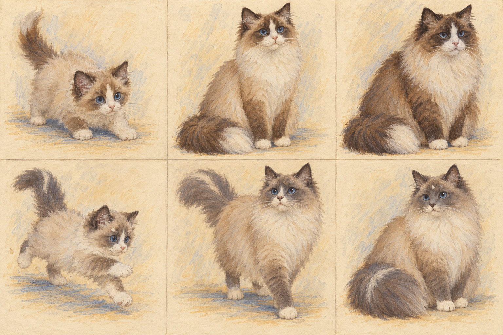

# Game 112 · Gallery 猫咪文字数据库 v1.1（待审）

> 2026-10-06。机器可读的完整 91 条目录记录与维度选项在 [`cat-gallery.v1.json`](../../../games/game112/cat-gallery.v1.json)。目前只开始布偶猫试作：6 张待修订概念图，不代表已有 91 张图，更不是房间里的可动角色。

## 1. 这份库收录什么

- 主干按 [TICA 的公开品种浏览目录](https://tica.org/ticas-breeds/browse-all-breeds/)抄录英文目录名：81 个**页面条目**，其中 19 个在本库标为长短毛、多趾、有尾或长腿等变体。TICA 网页称其认可 73 个品种；“页面条目数”与“品种数”不是同一口径。
- 补入 [CFA 品种目录](https://cfa.org/breeds/)中的 4 个独立名称，以及 [FIFe 品种目录](https://fifeweb.org/cats/breeds/)中的 4 个独立名称；它们只表示“本版补充来源”，**不**表示其他机构不认可。
- 另外单列 FIFe 的家猫长毛、家猫短毛 2 项。它们是**非纯种分类，不是两个新造的血统品种**；真实世界的混种/家猫不能在图鉴里消失。参见 [TICA Household Pet](https://tica.org/breed/household-pet/)。
- 因协会认定、别名、毛长分项和新认定状态会变化，这不是“世界唯一且永远完备的品种数”。每条保留英文原名、中文显示名、来源和稳定 ID；下一版可补协会交叉映射与别名，不改旧 ID。

## 2. 91 条的审核视图

| 来源 | 条目 | 本版重点 |
|---|---:|---|
| TICA 目录 | 81 | 含 19 个显式变体；英文名按网页原文，中文名待美术/品种顾问复核 |
| CFA 补充 | 4 | 重点色短毛猫、欧洲缅甸猫、褴褛猫、玩具短尾猫 |
| FIFe 补充 | 4 | 欧洲猫、德国卷毛猫、涅瓦假面猫、索科克猫 |
| FIFe 家猫分类 | 2 | 长毛家猫、短毛家猫；非纯种分类 |

首批需要你特别看命名的条目：Cherubim、高地猫、威尔士猫、尼伯龙猫、拉邦猫、皮克斯短尾猫、玩具短尾猫。中文俗名存在地区差异，英文原名是本版的核对锚点。完整逐条清单不在本文另抄一遍，避免与 JSON 两份名单漂移；在游戏 Gallery 里也能按中文/英文搜索、翻页和按来源浏览。

## 3. N×N 的轴：独立字段，而非预先穷举所有图

| 轴 | 当前文字选项 | 解释 |
|---|---|---|
| 种类/血统 | 91 个目录条目 ID | 变体有 `variantOf`；家猫有 `nonPedigree`。不得凭照片自动断言纯种血统 |
| 年龄阶段 | 幼猫、少年猫、成年猫、年长猫、未记录 | 美术视觉阶段，不是医疗年龄诊断；精确岁月可另存用户提供的事实 |
| 视觉体型 | 娇小、中等、高大、未记录 | 个体当前外观，不把每个品种写死成一个尺码；还需与房间透视缩放分开 |
| 性别 | 母、公、未记录 | 可由主人填写；不能仅凭图片可靠判断，生成图也不必强造公母差异 |
| 性格 | 好奇、谨慎、黏人、独立、好胜、贪玩、耐心 | 每只猫 7 个 0–100 的独立数值；不是性别或品种推断，也不靠一张静态画像诊断 |
| “品相”/外观 | 毛长、底色、花纹、白斑、耳形、尾形、眼色 | 中性形态标签，**不是外貌优劣、赛级评分或价格**；底色/花纹等拆轴参考 [FIFe EMS](https://fifeweb.org/cats/ems-system/) |

外观选项见 JSON `dimensions.appearance`。其中“虎斑/斑点/云纹”“双色/高白”等是面向美术检索的简化词；正式品种与色号对应要有协会规则/基因和顾问校验，不能因为 N×N 能组合就声称每种组合都存在或符合品种标准。

## 4. 布偶猫试作：公/母 × 幼/成年/年长

首批是两只可追踪身份的示例猫，各有三个人生阶段。公猫 A 为海豹双色，身份锚是略不对称的白倒 V、右眼外侧小斑、浅色尾尖；母猫 B 为蓝手套重点色，身份锚是右眼上方浅色缺口、蓝灰尾中的浅毛。公母字段是**设定资料**，不能靠毛色或体型断定。性格向量分别偏“先观察再参与”和“自主接近、爱玩”，不意味着所有公猫或母猫都这样。七个性格词沿用 [GDD §6.1](./gdd.md)。

这张方向板的年龄与绘本质感比下方透明试作更清楚；它本身是六格概念构图，不是能拆成六只、直接放进房间的透明立绘。公母各占一行，三列依次为幼年、成年、年长。身份标记与毛色还需要逐格人工复核。

| 身份 | 幼猫 | 成年猫 / 年轻期 | 年长猫 |
|---|---|---|---|
| 公猫 A | [01 · 待修：幼年差异不足](../../../public/games/game112/art/gallery/ragdoll/seal-bicolor-male-kitten-v1.png) | [02 · 待修：边缘毛边](../../../public/games/game112/art/gallery/ragdoll/seal-bicolor-male-adult-v1.png) | [03 · 待修：与成年太像](../../../public/games/game112/art/gallery/ragdoll/seal-bicolor-male-senior-v1.png) |
| 母猫 B | [04 · 待修：毛量与边缘](../../../public/games/game112/art/gallery/ragdoll/blue-mitted-female-kitten-v1.png) | [05 · 待修：透明光晕](../../../public/games/game112/art/gallery/ragdoll/blue-mitted-female-adult-v1.png) | [06 · 待修：年龄与光晕](../../../public/games/game112/art/gallery/ragdoll/blue-mitted-female-senior-v1.png) |

六张全是**概念试作 / `needs-revision`**，并非六张已通过的素材。01/04 的幼年体态和毛量还不够稳定；03/06 和成年图年龄差异不足；01–04 的透明毛发有彩色杂边，05/06 的 alpha 层有背景光晕。它们仅在 Gallery 作为带标注的样本预览，不用于房间猫、Live2D、卡牌对手或用户上传猫。04 曾连续两次生成连接失败，服务恢复后才获得当前待审稿。

年龄画法依据是同一猫的毛量、体态、色点成熟度演变，不是病弱符号。布偶猫的蓝眼、重点色和缓慢成熟以 [TICA 布偶猫资料](https://tica.org/breed/ragdoll/)和 [CFA 品种标准](https://cfa.org/breed/ragdoll/)为外形参考；本项目的 0–100 性格数值是虚构角色设计，不是协会的性格测量。

本轮使用 OpenAI 内置图像生成。提示词链：先以 `visual/cat-art-direction-ragdoll-v2-lived-in.png` 为风格参考，各生成一张海豹双色公猫和蓝手套母猫的成年身份母图；再逐张以对应成年图为身份参考，要求保留面罩、眼部标记与尾尖/尾中浅毛，分别变为幼猫的紧凑体态、短颈毛、浅色点，或年长猫的健康从容姿态、略深色点。通用约束是蓝眼、绘本可见笔触、全身三分之四视角、真透明、无场景/文字/道具/性别配饰/亮面 3D 感。另用“2×3 绘本纸张、两行身份一致、三列年龄差异强、手绘水粉与彩铅、无文字”生成上方方向板。每张更具体的生成描述记录在本地美术索引 `provenance.prompt`；后续重做须先解决当前质量问题。

## 5. 图片记录的结构与边界

一张**真实存在**的图片才新增一条稀疏记录：`imageId`、`characterId`、`breedId`、`ageStage`、`bodySize`、`sex/unknown`、`appearance`、`pose/view`、`styleVersion`、`assetKey`、`reviewStatus`。未通过审核也可以作为**显式试作记录**，但不能被当成正式图使用。同一猫种可有多个姿态与色型，但不存在的组合不生成空图，也不批量产出笛卡尔积。需要按场景匹配尺寸时，另用房间的 `catSpot` 标定，不把“缅因猫=一张固定像素高”写死。

玩家上传自己的猫属于**私有身份与有授权来源的资产**，不能因外观相似自动并入公共品种图库，也不应继承虚构品种故事。名字、记忆和照片是否上传/生成必须分别取得清晰同意；Gallery 的公共标准猫图与私人纪念猫图分库存储。

## 6. 页面与下一关

Gallery 是第 8 个**功能菜单位**，不是第 8 间房。馆图已有“08 回忆阁楼”，房间 `gallery` 是“回忆廊”；二者均不改名、不改变十房拓扑。当前实现从主厅画内的 Gallery 木牌和晶球名册进入，右侧抽屉保留当前房间，先展示布偶猫绘本方向板，再展示 6 张待审透明试作、文字维度、搜索与目录分页。不拿雪团图片假装 91 个品种图。

下一关：先修透明边缘和光晕，并重做年龄差异最弱的 03/06；六格身份连续性通过人工审阅后才能标为正式资产。其余 90 个目录条目的命名、代表色与合规外观组合仍待审核，不自动批量出图。
