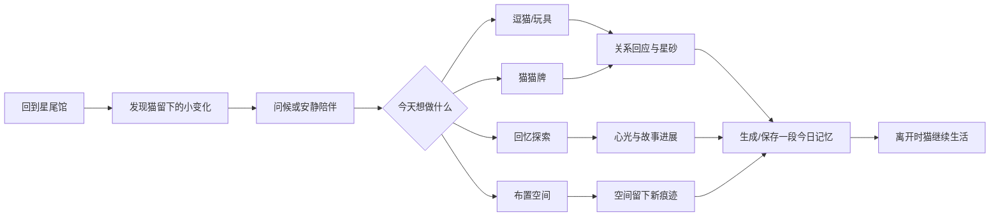
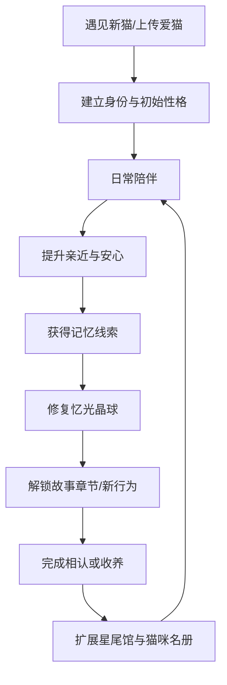
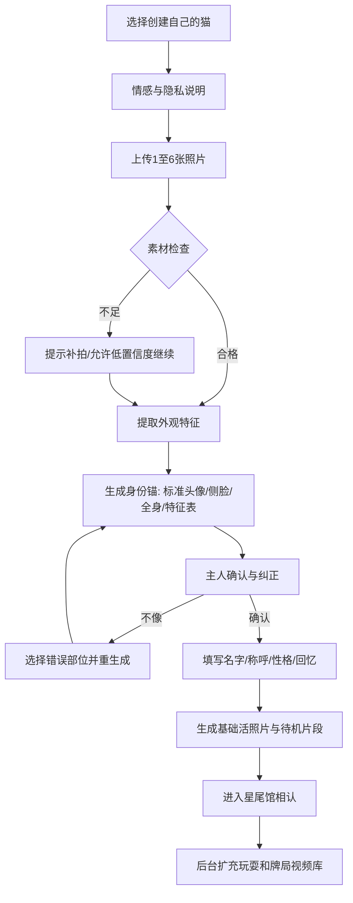
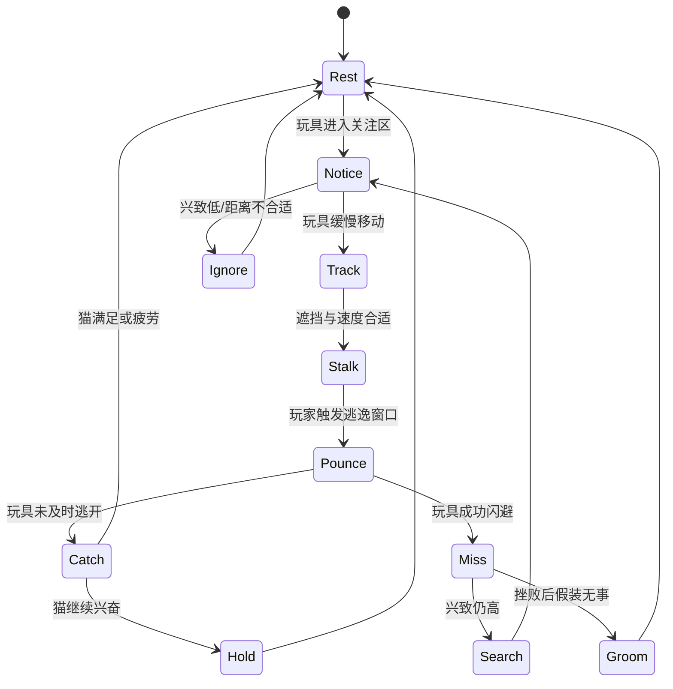
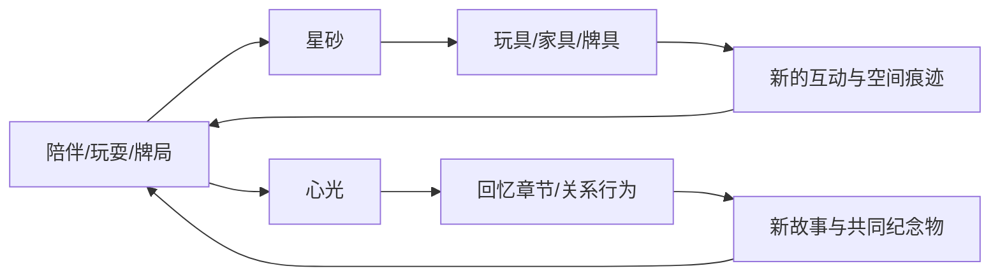

# Game 112《星尾会客厅》·完整策划案（GDD）

> **版本**：0.1 · 2026-09-22
> **阶段**：S1 策划整理中，未进入 capability plan 与实现。
> **工作名**：《星尾会客厅》；最终名称待 owner 确认。
> **阅读提示**：🟢 owner 已明确；🟡 策划推荐、待确认；⚪ 尚未讨论。

---

## 0. 执行摘要

### 0.1 一句话

> 在喵星的星尾会客厅里，遇见、收养并陪伴拥有往昔记忆的猫；也可以上传自己爱猫的照片，让它成为能够陪你打牌、玩耍和继续留下新回忆的数字陪伴化身。

### 0.2 三句话

1. 🟢 玩家来到喵星上的共同空间，认识不同品种、毛色、性格和经历的猫。
2. 🟢 失去爱猫或仍想把爱猫带在身边的主人，可以上传照片，为它建立稳定的数字陪伴形象。
3. 🟢 玩家通过安静陪伴、逗猫、猫猫牌和回忆探索建立关系；爱诗视频负责让照片“活起来”，确定性游戏系统负责玩法、经济与长期进度。

### 0.3 产品类型

> **数字宠物陪伴 × 轻卡牌 × 回忆叙事 × 收藏布置 × AI 视频演出**

它不是：

- 餐厅流水线经营游戏；
- 只播放 AI 视频的相册；
- 用连续签到绑住玩家的电子宠物；
- 宣称能够复活、还原意识或替代真实猫的产品。

### 0.4 核心独特性

| 普通数字宠物 | 《星尾会客厅》 |
|---|---|
| 预设宠物外形 | 官方猫 + 用户真实爱猫的身份化身 |
| 通用动画循环 | 根据猫身份、关系和故事生成的个性化视频片段 |
| 喂食清洁维持数值 | 无惩罚陪伴、牌局与回忆共鸣 |
| 宠物等待玩家操作 | 猫在玩家离开后也有自己的生活与小事件 |
| 收集皮肤 | 收养拥有独立历史和记忆章节的猫 |

---

## 1. 名称与品牌方向 🟡

### 1.1 推荐工作名

**《星尾会客厅》**

- “星尾”同时指喵星、流星尾迹和猫尾巴。
- “会客厅”比“咖啡厅”更宽，允许牌桌、游戏角、晶球厅、休息区和回忆展陈。
- 语气温和，不直接消费死亡，也不把产品限制成经营题材。

### 1.2 备选名

| 名称 | 优点 | 风险 |
|---|---|---|
| 《喵星会客厅》 | 一眼懂题材 | 辨识度较普通 |
| 《星尾馆》 | 简短、世界观感强 | 单看名字不知道是猫 |
| 《猫在星光里》 | 情绪柔软 | 像绘本或电影名，玩法感弱 |
| 《再陪你坐一会儿》 | 情感直达 | 不利于长线系列化，略伤感 |

### 1.3 推荐标语

> **在记忆发亮的地方，再陪它坐一会儿。**

---

## 2. 目标用户与情感边界

### 2.1 核心用户

- 失去过猫，希望保留陪伴感与共同记忆的人。
- 现实中养猫，希望把自己的猫带入数字空间的人。
- 喜欢猫但暂时无法养猫的人。
- 喜欢低压力收藏、轻卡牌和情感叙事的人。

### 2.2 玩家真正购买的体验

不是“更像真的 AI 猫”，而是四种安全感：

1. **识别感**：我一眼能看出这是我的猫。
2. **回应感**：它会对我做的事情产生带性格的反应。
3. **连续感**：昨天发生的事情今天仍有痕迹。
4. **保存感**：我讲给它的故事不会被系统擅自改写或消失。

### 2.3 情感伦理红线 🟢

- 不使用“复活”“灵魂重建”“它真的回来了”等承诺。
- 产品中使用“数字陪伴化身”“由照片与主人提供的记忆建立”。
- 不擅自生成死亡原因、临终画面、主人关系或猫的第一人称遗言。
- 不用断签、饥饿、疾病、衰老、再次死亡制造留存压力。
- 用户随时可以暂停生成、导出回忆资料和彻底删除上传内容。
- 对仍在世的猫、已经离开的猫、虚构猫提供不同但不带评判的创建入口。
- 高情绪内容播放前提供跳过、静音和“今天只想陪它坐坐”的选项。

---

## 3. 世界观

### 3.1 喵星

🟢 喵星不是天堂的宗教定义，而是一个温柔的幻想世界：所有被记住的猫，都可能在这里留下星光一样的痕迹。

玩家来到喵星的一座公共场所——🟡 **星尾馆**。它兼具：

- 会客厅：人与猫安静相处；
- 娱乐室：猫猫牌、逗猫、玩具；
- 星光商店：交换玩具、家具与装饰；
- 晶球厅：遇见猫、查看身份与进入记忆；
- 回忆廊：保存猫与主人共同留下的故事。

### 3.2 忆光晶球 🟡

馆内散布着磨砂般的发光晶球。每一颗晶球并不是囚禁灵魂，而是一个**记忆入口**：

- 官方猫的晶球保存它过去与人相处的片段。
- 用户上传猫的晶球保存主人确认过的照片、文字与生成内容。
- 当玩家与晶球建立连接，猫的数字化身便能在星尾馆出现。
- 修复更多记忆后，晶球内部会出现新的颜色、纹理和小物件。

### 3.3 猫的两种来历

| 类型 | 玩家动词 | 内容来源 | 关系语气 |
|---|---|---|---|
| 官方喵星猫 | 遇见、了解、收养 | 策划编写或真实故事授权改编 | 从陌生到信任 |
| 用户上传猫 | 上传、确认、相认、接回 | 用户照片与用户确认的记忆 | 重新建立数字陪伴 |

不把用户自己的猫放进随机收养池，也不允许其他玩家未经授权访问。

### 3.4 “田螺姑娘”式离线生活 🟢

玩家离开后，猫会继续在馆里生活。再次进入时，场景可能留下一个小变化：

- 把散落的牌推到一堆；
- 把喜欢的牌藏进纸袋；
- 在玩家常坐的位置睡过；
- 把玩具叼到桌边；
- 打翻杯垫后若无其事地舔毛；
- 从别处带回一枚无价值但有故事的小物件。

这些事件强调“它有自己的生活”，但不会替玩家自动消耗稀有资源、改变关键设置或造成损失。

---

## 4. 体验支柱

### 4.1 陪伴

玩家可以什么也不做。猫的呼吸、慢眨眼、换姿势、看向窗外和偶尔靠近，本身就是有效体验。

### 4.2 玩耍

逗猫不是反应速度小游戏，而是观察猫的注意、伏击、犹豫、扑击、抓获、玩累和再邀请。

### 4.3 牌局

猫猫牌提供可重复的主动玩法；猫通过真实猫行为表达性格，例如压牌、趴牌、推乱、走神和护住喜欢的牌。

### 4.4 回忆

回忆不是收集百分比，而是让玩家逐渐理解“这只猫为什么会成为现在的它”。

### 4.5 共同空间

玩家获得的装饰、玩具和牌具会永久留在星尾馆，形成自己与猫共同生活过的痕迹。

---

## 5. 核心循环

### 5.1 单次进入：3～15 分钟

### 5.2 日常循环

1. 查看猫在离线期间做了什么。
2. 感受今天的情绪与兴致，不出现惩罚性红字。
3. 选择一项主要活动：玩耍、牌局、回忆或布置。
4. 获得星砂、心光或一个故事线索。
5. 解锁一段动作、习惯、对话气泡或回忆片段。
6. 将今天的代表性片段保存进“星光相册”。

### 5.3 长期循环

### 5.4 失败与压力

- 没有猫死亡、逃跑、永久讨厌玩家。
- 牌局失败只影响当局奖励与猫的短暂表现，不降低长期关系。
- 玩具使用不当会让猫暂停、躲开或失去兴致，但不会产生罪恶惩罚。
- 长时间不登录后，猫只会说“你回来了”或展示自己的生活，不计算欠账。

---

## 6. 猫咪系统

### 6.1 猫咪身份数据

每只猫由纯数据档案定义：

| 类别 | 字段示例 |
|---|---|
| 身份 | 名字、昵称、来源、是否用户上传、隐私范围 |
| 外观 | 体型、品种参考、毛长、主色、辅色、花纹遮罩、眼色、鼻色、独特标记 |
| 性格 | 好奇、谨慎、黏人、独立、好胜、贪玩、耐心 |
| 偏好 | 玩具、触摸区域、牌型偏好、休息地点、声音敏感度 |
| 关系 | 亲近、安心、回忆共鸣、已建立的习惯 |
| 内容 | 行为片段目录、故事章节、主人确认的回忆、今日事件 |
| 生成 | 身份参考图、允许使用的提示词事实、禁止生成项、视频种子与版本 |

品种只影响外形倾向，不自动决定性格，避免“布偶一定温顺、狸花一定调皮”等刻板设定。

### 6.2 玩家可感知的关系状态

| 状态 | 类型 | 作用 | 是否下降 |
|---|---|---|---|
| **亲近** | 长期 | 解锁靠近、共同活动与专属习惯 | 不因断签下降 |
| **安心** | 长期/场景 | 决定是否允许触碰敏感区域、是否愿意睡在附近 | 只受明确事件影响，不随时间惩罚 |
| **心光** | 故事进度 | 修复回忆晶球、开启记忆章节 | 不可购买，不会消耗回退 |
| **兴致** | 当次临时 | 决定今天更想玩、打牌或休息 | 自然变化，下次进入重置 |

UI 默认用行为和短语表达，只在详情页提供柔和进度，不把关系做成密集数值仪表盘。

### 6.3 官方猫咪分布

官方猫库覆盖：

- 不同体型：圆胖、标准、修长、大型；
- 不同毛长：短毛、中长毛、长毛；
- 常见花纹：纯色、双色、重点色、虎斑、玳瑁、三花、奶牛、烟色；
- 不同年龄感：幼年、成年、老年；
- 可见但不猎奇的特征：缺耳尖、歪胡须、旧项圈印、异色瞳等。

文生图负责扩展候选，最终必须经过人物一致性、品种合理性、肢体与花纹人工复核。

### 6.4 收养与相认

- 官方猫：完成它的第一段故事后，可以邀请它常驻；不是抽卡获取。
- 上传猫：生成并确认身份后直接进入“相认”，不要求支付或刷好感赎回。
- 玩家可以拥有多只猫，但一个活动镜头通常只出现一只，避免身份、视频和交互混乱。
- 后续可解锁“两只熟悉猫短暂同场”，不进入首版。

---

## 7. 照片上传与“照片变活”

### 7.1 创建入口

系统先询问，不强迫填写：

- 它现在仍在你身边；
- 它已经去了喵星；
- 这是一只想象或创作中的猫；
- 今天不想回答。

该选择只改变文案和默认回忆问题，不改变功能、价格或权益。

### 7.2 推荐素材

- 最低可用：一张清晰正脸照片。
- 推荐：3～6 张，包括正脸、侧脸、全身和独特花纹。
- 自动检测：是否为猫、清晰度、遮挡、多人/人脸、重复图片。
- 如果照片不足，明确显示“可能无法稳定还原的部分”，不偷偷猜测。

### 7.3 创建流程

### 7.4 身份确认页必须允许修改

- 毛色与花纹位置；
- 眼睛颜色；
- 毛长与体型；
- 耳朵、尾巴和独特标记；
- 年龄感；
- “这不像它”的自由反馈。

玩家确认前，任何生成内容不进入正式猫档案。

### 7.5 回忆资料规则

- 用户可录入文字、日期、地点、喜欢的事和照片。
- AI 可以帮助润色或整理，但必须并排展示原文并由用户确认。
- AI 不补写用户没有提供的敏感事实。
- 支持“只保存，不生成故事”；支持跳过所有回忆输入，仅使用陪伴功能。

### 7.6 隐私与删除

- 上传照片默认私有，不进入公共训练、公共猫池或其他玩家内容。
- 明确列出生成服务需要传输的素材与保存期限。
- 支持单独删除原始照片、生成视频或整只数字猫。
- 删除整只猫前提供导出；确认文案不使用情绪胁迫。

---

## 8. 爱诗视频与高保真表现方案

### 8.1 结论

🟢 不以纯 3D 或传统 3 渲 2 为最终核心。推荐采用：

> **身份锚定的照片转视频 + 分支短视频角色 + 实时 2D 交互叠层 + 本地缓存回退。**

### 8.2 三种视频层级

| 层级 | 内容 | 生成时机 | 是否阻塞操作 |
|---|---|---|---|
| 基础活照片 | 呼吸、眨眼、耳朵转动、轻微换姿势 | 创建猫时优先生成 | 不阻塞；失败用静态图微动 |
| 互动短片 | 注意、伏击、扑击、抓住、压牌、趴牌等 | 常用包预生成，个性包后台生成 | 不阻塞；使用缓存或基础片段 |
| 回忆影片 | 完整场景、过去故事、纪念日或分享片 | 明确触发后异步生成 | 生成页可离开，完成后通知 |

### 8.3 “实时”的产品定义

不承诺云端逐帧实时生成。玩家感知的实时来自：

1. 玩具、光标、卡牌和音效立即响应；
2. 猫立刻播放缓存中的注意/追踪基础反应；
3. 行为系统预测下一个可能状态并提前请求视频；
4. 只在中性姿势、遮挡或镜头切点接入新片段；
5. 生成失败时无感回退，不弹出破坏陪伴的技术错误。

### 8.4 视频角色状态机

### 8.5 视频片段制作约束

每段片由数据规格描述，至少包含：

- 猫身份版本；
- 场景与固定镜头；
- 起始姿势和结束姿势；
- 片长、循环性、情绪与能量等级；
- 猫在屏幕中的锚点和可交互区域；
- 可衔接的下一片段集合；
- 失败回退片段；
- 生成提示词、参考图、种子与人工审核状态。

常用片段优先生成“回到中性姿势”的尾部，降低切换跳变。

### 8.6 画面合成

- 猫视频：高保真主体，可通过标准背景生成后抠像/视频分割得到透明层。
- 空间：静态或轻动态背景，允许装饰替换与长期痕迹。
- 实时层：逗猫棒、卡牌、点击反馈、粒子、字幕与菜单。
- 前景遮挡：桌沿、椅脚、纸袋等独立层，用于隐藏视频切换点。
- 回忆影片：允许整屏完整视频，不要求透明角色层。

### 8.7 一致性与审核

- 每只上传猫先建立经主人确认的身份锚，视频不能直接从任意单张照片自由发挥。
- 自动检查猫脸、毛色、花纹、眼睛、耳尾和肢体异常。
- 不合格片段不进入缓存；系统继续使用旧片段。
- 主人可以对任何片段标记“不像它”“动作不舒服”“不要再生成这种内容”。

### 8.8 当前引擎事实与缺口

已查到：

- `AishePort` 已支持提示词、画幅、时长、负面词、种子与异步视频句柄。
- LayoutNode 已有 `Video` 控件，适合开场、回忆影片和预览。
- 2D 精灵、卡牌、输入与 UI 可承担实时叠层。

尚不能直接表达：

1. 带身份参考图/首尾帧/角色 ID 的爱诗生成请求；
2. 可预载、缓存、片段切换、结束事件和回退的 `VideoActor`；
3. 视频角色的透明/遮罩合成与可交互命中区；
4. 视频生成结果的自动质检与主人审核队列。

正式实现前必须走 capability 缺口裁决：

- **A（推荐）**：下沉通用媒体角色能力，所有游戏用数据描述视频片段与状态机；成本较高，但可复用、可审计。
- **B**：只用现有 `Video` 播整屏影片，游戏变成选择后看片；实现快，但不能兑现动态陪伴与逗猫。

本 GDD 推荐 A，等待 owner 在 S2 正式裁决；未裁决前不写游戏层视频解释器。

---

## 9. 日常陪伴与逗猫

### 9.1 陪伴场景

- 固定中近景，猫处于常用休息位。
- 玩家可以呼唤、慢慢靠近、触摸或保持安静。
- 触摸区域：头顶、脸颊、下巴、背部、前爪；每只猫有不同偏好。
- 系统读取区域、方向、速度、持续时间与当前安心/兴致。
- 猫的拒绝是正常边界，不等于好感惩罚。

### 9.2 逗猫场景

固定低机位，玩家移动玩具，猫通过完整狩猎链回应：

> 发现 → 定向 → 追踪 → 伏击 → 屁股摇动 → 扑击 → 抓获/扑空 → 后脚蹬/寻找/舔毛掩饰 → 休息或再邀请

玩具类型改变行为而非只换皮：

| 玩具 | 行为特点 |
|---|---|
| 羽毛杆 | 空中与地面混合，适合追踪、伏击和扑击 |
| 小球 | 有惯性与遮挡，适合追赶和拨回 |
| 纸袋 | 作为伏击点和躲藏空间 |
| 光点 | 反应快但不能真正抓住，必须安排“实体奖励”结束，避免挫败 |
| 绳结 | 适合抱住和后脚蹬 |

### 9.3 乐趣来源

- 不完全服从：猫可能假装不感兴趣。
- 可读预兆：耳朵、瞳孔、尾尖和身体重心透露下一步。
- 成功与失败都好看：扑空、滑倒、找错方向也是奖励。
- 玩家逐渐学会“这只猫喜欢怎样玩”，而不是记统一最优操作。

---

## 10. 猫猫牌 🟡

### 10.1 定位

- 最重的可重复玩法，但不能压过陪伴主题。
- 一局推荐 5～8 分钟。
- 规则确定性、可复盘；猫的视频和性格只改变表现与决策风格。
- 不出售决定胜负的强力牌。

### 10.2 首版玩法提案：“星爪牌”

> 本节是可原型化提案，完整数值与牌表需在 S2 另开卡牌规则分册确认。

- 双方各有手牌，中央有三个“星盘”作为公共落牌区。
- 牌以月相、星色和爪印构成简单集合关系。
- 回合选择一个星盘放牌，完成同色、连续或成对组合获得星光。
- 每局双方各有少量“猫爪动作”：换盘、压住一张牌、把顶牌拨走等。
- 先达到目标星光或牌库结束时星光更高者获胜。
- 猫的 AI 按性格选择：谨慎攒组合、好胜抢分、贪玩频繁用猫爪、困倦偏向快速结束。

### 10.3 猫性表演

- 思考时盯牌、看玩家或走神；
- 出牌用爪拨到中央，不长出人手；
- 压住玩家想拿的牌；
- 输牌后推乱牌堆、尾巴拍桌或直接趴上去；
- 赢牌后不做人的庆祝动作，而是慢眨眼、得意坐直或护住战利品。

### 10.4 公平边界

- 猫可以“捣乱”，但必须是规则内明确动作。
- 好感度不提供直接数值优势；高关系解锁新表演、牌背和友好让步模式。
- 牌局失败不降低关系，只改变短暂反应和奖励。

---

## 11. 回忆系统

### 11.1 官方猫故事

每只官方猫至少包含：

1. **现在的习惯**：玩家先从行为认识它。
2. **一件旧物**：触发对过去的疑问。
3. **一段人与猫的生活**：不是只有告别，也有琐碎快乐。
4. **未完成的小愿望**：玩家通过陪伴帮助完成。
5. **新的共同记忆**：故事不止回望过去，也继续向前。

### 11.2 上传猫的回忆

- 内容由主人录入或确认。
- 允许只保存片段，不组成线性传记。
- 可选择语气：温暖日常、纪念、幽默、安静。
- 不强迫出现离别；“最后一天”永远不是必填章节。
- 生成影片前展示将使用的照片、文字和提示词摘要。

### 11.3 回忆解锁逻辑

- 通过自然陪伴获得“心光”，不是购买钥匙。
- 猫在安心时可能主动靠近晶球或带来旧物。
- 回忆可以随时暂停，离开后保留进度。
- 完成章节获得新的动作、空间纪念物或共同照片，不奖励战力。

### 11.4 星光相册

保存：

- 用户上传原始记忆；
- 生成并确认的视频；
- 牌局趣事和逗猫高光；
- 猫的离线生活片段；
- 共同空间随时间变化的照片。

所有 AI 内容明确标注“根据你的素材生成”，但标记应克制，不破坏沉浸。

---

## 12. 经济循环

### 12.1 目标

经济系统用于制造长期选择和空间积累，不利用悲伤，不出售关系。

### 12.2 两条核心资源 🟡

| 资源 | 来源 | 用途 | 能否购买 |
|---|---|---|---|
| **星砂** | 牌局、玩耍、每日小事件、故事任务 | 玩具、家具、牌背、晶球底座、空间装饰 | 商业化未定；首版按不可购买设计 |
| **心光** | 陪伴、主人确认回忆、完成猫的故事节点 | 解锁回忆与关系行为；表现为累计进度，不扣除 | 绝不可购买 |

可选第三资源“星钥”只作为完成一只猫故事后的章节钥匙，不进入付费循环；是否需要待验证。

### 12.3 资源循环

### 12.4 商店原则

- 不卖“让你的猫更爱你”。
- 不随机抽取上传猫的视频反应。
- 不把主人自己提供的照片和回忆锁在付费墙后。
- 付费方向若存在，优先是可预期的装饰包、额外云生成额度、高清导出与非必要主题空间。
- 任何生成额度耗尽时，基础陪伴、牌局和已有视频仍可使用。

### 12.5 留存原则

- 无强制连续签到。
- 无体力上限阻止陪伴。
- 每日事件可以累计有限天数，避免错过焦虑。
- 回归奖励以“猫这几天做了什么”呈现，不以补偿欠账呈现。

---

## 13. 场景与固定镜头

### 13.1 首版场景

| 场景 | 镜头 | 主要用途 |
|---|---|---|
| 星尾馆主厅 | 中景固定机位 | 登录后问候、安静陪伴、进入其他活动 |
| 星牌桌 | 桌面略俯视固定机位 | 猫猫牌；猫脸与前爪是中心 |
| 逗猫角 | 低机位固定镜头 | 玩具拖动、伏击、扑击与抓获 |
| 晶球厅 | 缓慢但不可自由旋转的展示镜头 | 选择猫、查看身份、进入回忆 |
| 回忆廊 | 全屏视频/相册 | 播放过去与共同记忆 |
| 星砂杂货铺 | 场景化菜单 | 购买玩具、家具和牌具 |

### 13.2 视觉原则

- 高保真猫，轻度风格化空间。
- 暖实用灯光与喵星冷色光并存，但避免标准化电影蓝橙滤镜。
- 空间有磨损、歪斜、遮挡和不成套物件，降低 AI 生成的完美感。
- 装饰有星轨、月相、猫爪星座和磨砂晶体，但不做廉价霓虹太空酒吧。
- 每个镜头必须预留实时交互层与菜单安全区。

### 13.3 当前视觉锚

- [`visual/cat-art-direction-ragdoll-v2-lived-in.png`](./visual/cat-art-direction-ragdoll-v2-lived-in.png)
- [`visual/scene-cat-play-ragdoll-v1.png`](./visual/scene-cat-play-ragdoll-v1.png)

---

## 14. 新玩家前 20 分钟

| 时间 | 体验 | 目的 |
|---|---|---|
| 0～2 分钟 | 进入星尾馆，布偶猫远远观察玩家 | 先建立安全与好奇，不先弹菜单 |
| 2～5 分钟 | 选择坐下、呼唤或安静等待；猫根据选择靠近 | 教会“什么都不做也可以” |
| 5～8 分钟 | 猫拨来一张星爪牌，完成三回合教学 | 引出主要可重复玩法 |
| 8～11 分钟 | 获得第一点心光，猫带玩家看见一颗晶球 | 引出世界观与回忆 |
| 11～15 分钟 | 展示“遇见官方猫”与“接回自己的猫”两个入口 | 明确产品核心，但不强迫立刻上传 |
| 15～20 分钟 | 玩家选择逗猫或填写自己的猫名字；获得第一件空间物品 | 完成一轮可控投入与永久痕迹 |

上传照片可以稍后完成；首次启动不要求用户立刻面对失去经历。

---

## 15. 内容结构与更新

### 15.1 每只官方猫的最小内容包

- 1 份身份与外观数据；
- 1 套基础活照片；
- 8～12 个基础陪伴/玩耍片段；
- 4～6 个牌桌表现片段；
- 3 段回忆章节；
- 1 个独特玩具偏好；
- 1 个空间习惯；
- 1 件完成故事后留下的纪念物。

### 15.2 用户猫的初始内容包

- 经主人确认的身份锚；
- 基础呼吸、眨眼和注视；
- 通用安全动作包的身份化版本；
- 一套基础牌桌动作；
- 一个可选的主人自述回忆；
- 后台逐步扩充的视频缓存。

### 15.3 内容更新方向

- 新官方猫与新故事；
- 新牌型与牌桌主题；
- 新玩具和行为链；
- 季节性但不限时绝版的星尾馆装饰；
- 新的视频生成模板与更稳定的身份模型；
- 主人授权的真实猫故事专题。

---

## 16. 首个可玩竖切

### 16.1 必须有

- 一间可进入的星尾馆主厅。
- 一只官方布偶猫，能够问候、待机和逗猫。
- 一个用户上传猫的完整创建/确认/删除流程。
- 基础照片转活结果和至少一种失败回退。
- 一套 5 分钟猫猫牌闭环。
- 一条三段式官方猫回忆。
- 星砂购买一个玩具并在场景中生效。
- 心光解锁一个新行为和一段回忆。
- 视频生成、缓存、播放和错误降级可被真实目击。

### 16.2 可以延后

- 多猫同场；
- 玩家之间访问；
- 桌面悬浮猫；
- 复杂房间自由装修；
- 长篇主线；
- 视频分享社区；
- 付费系统。

### 16.3 竖切成功判据

1. 上传者能认出自己的猫，而不是只认出品种。
2. 网络生成失败时仍能完成陪伴与牌局。
3. 玩家在十分钟内至少一次因为猫的行为而非奖励数值产生情绪回应。
4. 回忆流程不会在未确认时擅自增加事实。
5. 菜单不会遮住猫的主要表演，也不把产品做成管理后台。

---

## 17. 风险与对策

| 风险 | 后果 | 对策 |
|---|---|---|
| 上传猫身份漂移 | 用户立即失去信任 | 先身份锚、主人确认、版本化参考图、坏片不入库 |
| AI 视频等待太久 | 陪伴被技术队列打断 | 缓存优先、本地基础反应、后台生成、无感回退 |
| 视频片段切换跳变 | 像随机短视频拼接 | 固定镜头、统一首尾姿势、遮挡切点、状态机限制转移 |
| 过度拟人化 | 猫失去真实魅力 | 牌局轻拟人，触摸与玩耍坚持真实猫行为 |
| 消费悲伤 | 品牌不可被信任 | 不卖关系/回忆、不制造第二次失去、敏感内容由主人确认 |
| 经济系统压过陪伴 | 退化成日常打卡经营 | 低货币可见度、无欠账、奖励空间痕迹和故事而非战力 |
| 官方故事太煽情 | 用户疲劳或被触发 | 日常快乐占多数，离别不是每只猫的终点和高潮 |
| 云成本失控 | 个性视频不可持续 | 分层生成、公共动作模板、缓存复用、额度透明、高清按需 |
| 当前引擎只有普通 Video | 无法做互动视频角色 | S2 裁决并下沉通用 VideoActor，不在 game112 写私有解释器 |

---

## 18. 数据驱动边界

以下全部应为数据，而不是 game112 私有代码：

- 猫身份、外观、性格、偏好与关系状态；
- 视频片段目录、状态转移、首尾姿势和回退关系；
- 回忆章节、主人确认状态与内容安全标签；
- 玩具、家具、牌具、货币来源与价格；
- 页面、菜单、导航、提示文案与错误状态；
- 猫猫牌牌表、AI 风格参数与奖励表。

需要引擎通用 capability 承担：

- 照片上传与媒体作业；
- 身份参考驱动的视频生成端口；
- 视频角色预加载、缓存、切换、事件与遮罩；
- 连续指针轨迹和身体区域命中；
- 卡牌规则、对手决策与确定性结算；
- 存档、删除、隐私与媒体生命周期。

禁止在游戏层手写视频播放器、自由 DOM、自由状态机或网络生成胶水。

---

## 19. 决策台账

### 🟢 已明确

- 世界以喵星为背景，陪伴与回忆是核心。
- 包含不同品种和毛色的猫，也接受用户上传真实猫照片。
- 猫可以被收养、交流、有自己的回忆和过去主人故事。
- 猫能够打牌；牌局是重要玩法。
- 日常有玩耍/逗猫，高保真表现结合爱诗视频。
- 不要求纯 3D；探索照片直接变活与视频转接方案。
- 需要长期经济循环。

### 🟡 本案推荐、待确认

- 游戏工作名《星尾会客厅》，场所名“星尾馆”。
- 记忆媒介称“忆光晶球”。
- 星砂 + 心光两资源结构。
- 猫猫牌首版采用“星爪牌”公共星盘提案。
- 视频角色采用缓存即时响应 + 后台生成 + 中性姿势衔接。
- 官方猫用“收养”，用户猫用“相认/接回”。

### ⚪ 尚未讨论

- 最终平台与屏幕比例优先级。
- 完整牌规与数值。
- 商业模式、生成额度和云端预算。
- 社交、分享和多猫同场范围。
- 故事主线是否存在统一馆主/NPC。
- 桌面悬浮猫是否首发。

---

## 20. 相关文档

- 页面与导航：[`menu-flow.md`](./menu-flow.md)
- UI 视觉交接：[`ui-visual-handoff.md`](./ui-visual-handoff.md)
- 一页立项卡：[`brief.md`](./brief.md)
- 视觉资料：[`visual/`](./visual/)
