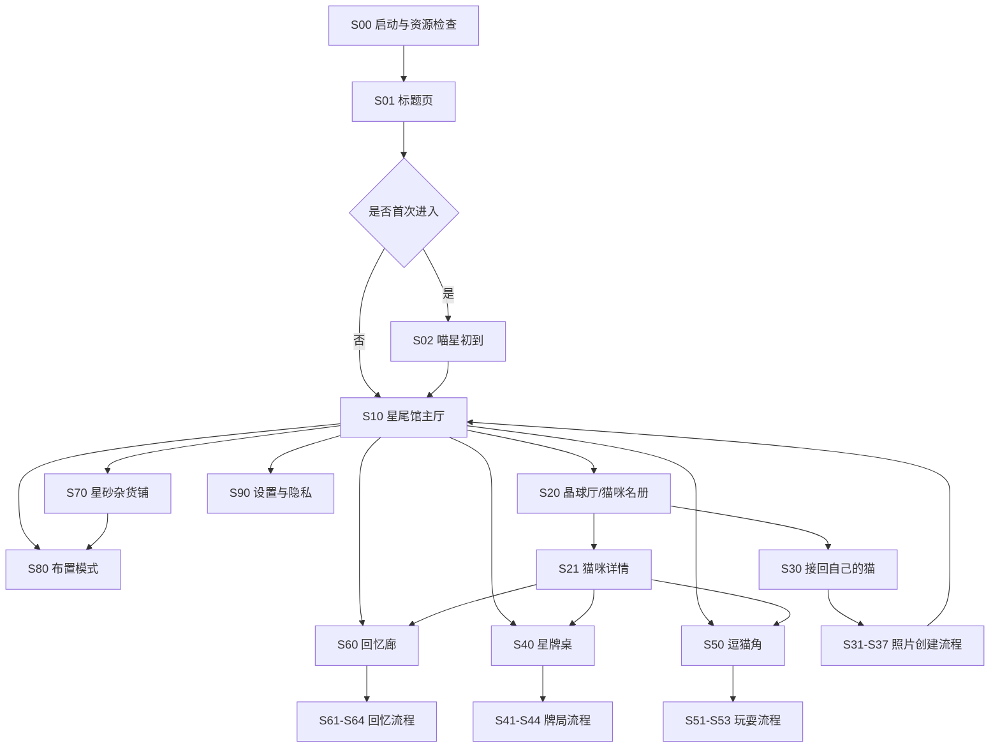
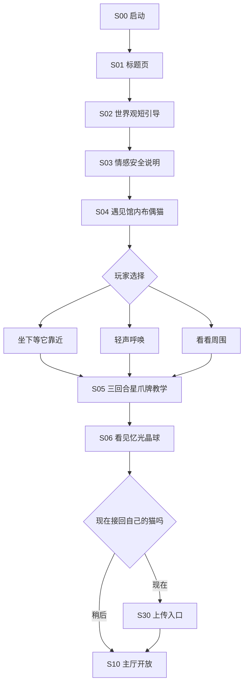
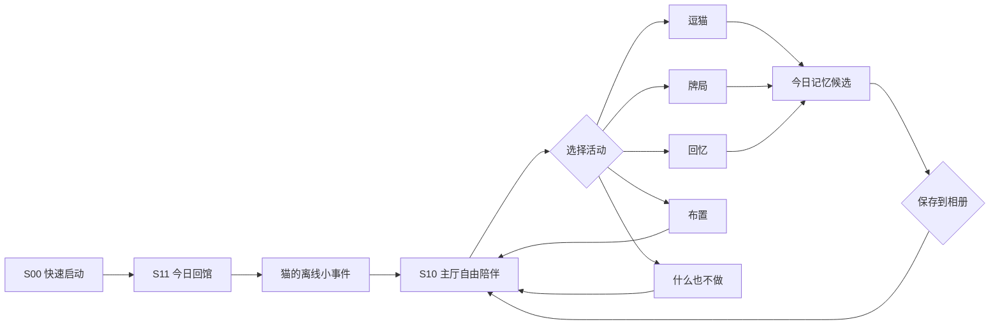
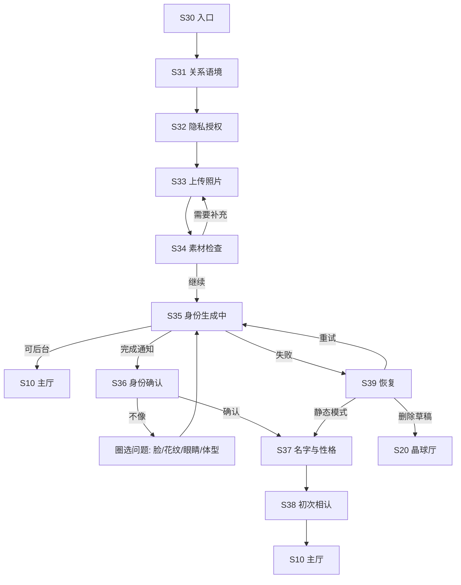
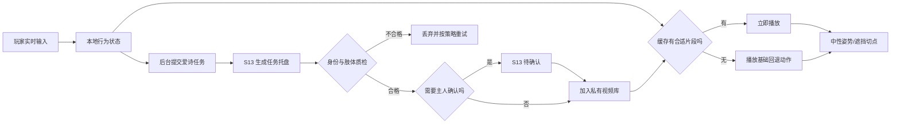
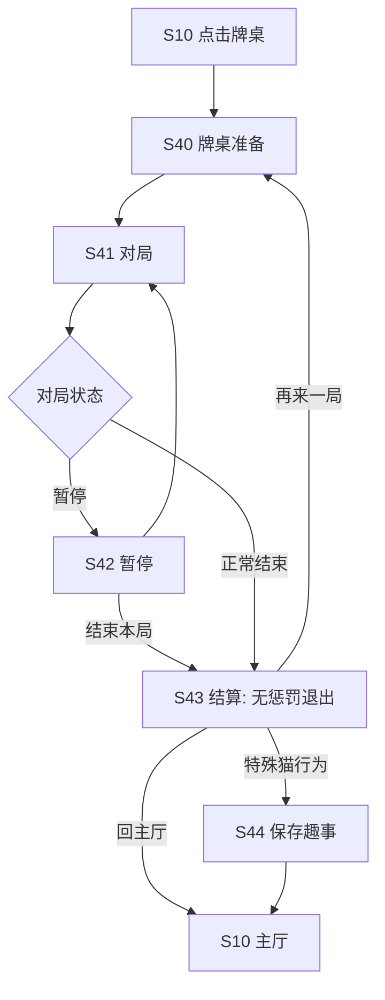
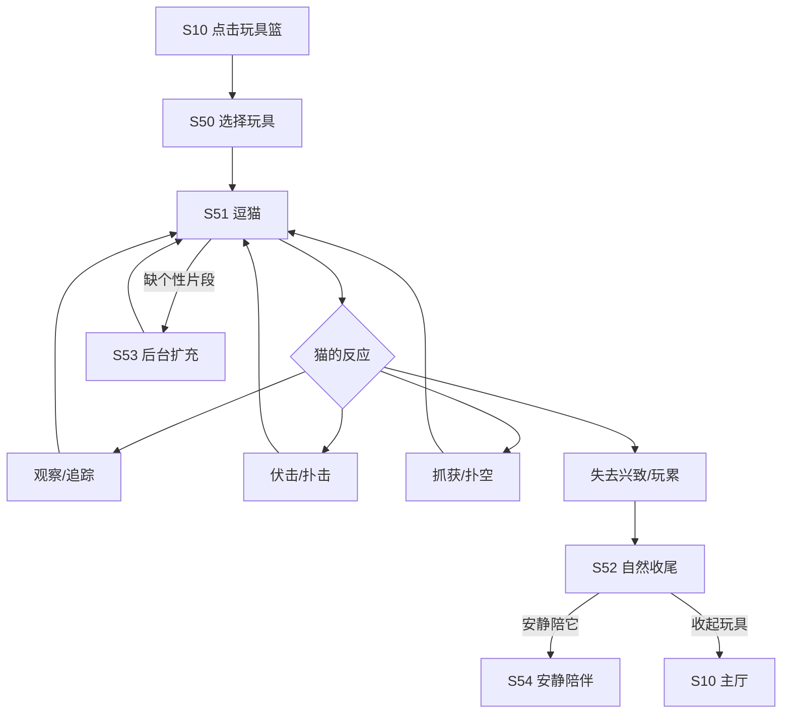
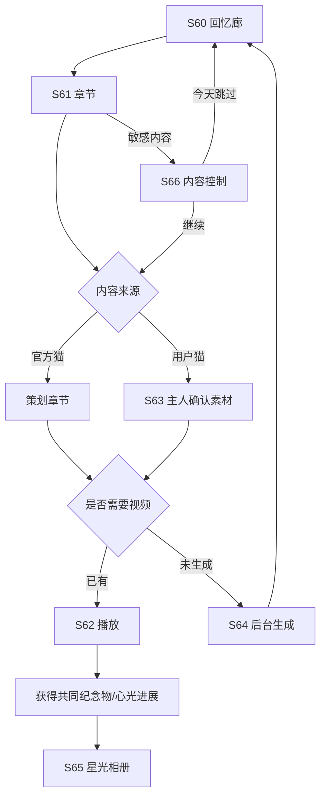
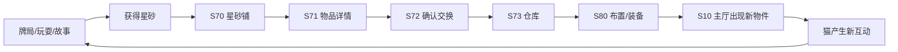
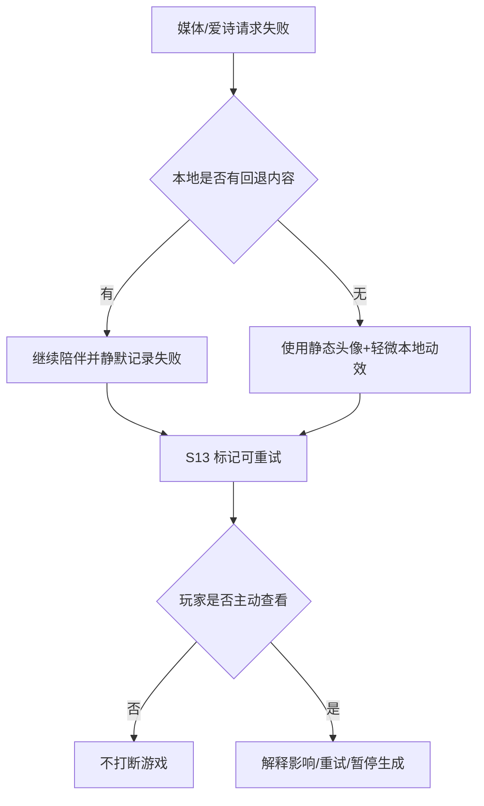

# Game 112《星尾会客厅》·菜单、页面与流程导向策划

> **用途**：交给产品、UI/UX、Crow Code / Claude Code 做页面结构与交互原型。
> **版本**：0.1 · 2026-09-23
> **依赖**：产品口径以 [`gdd.md`](./gdd.md) 为准；本文件只定义信息架构、页面状态与导航。
> **实现红线**：所有正式 UI 最终必须由 LayoutNode 闭集表达；本文是设计规格，不授权手写 React/DOM。

---

## 0. 导航总原则

1. **猫先于菜单**：进入游戏首先看见猫，不先看见任务、货币或活动弹窗。
2. **主厅即首页**：不做传统九宫格大厅；主厅场景中的物件是活动入口。
3. **一次只做一件事**：牌局、逗猫、回忆和布置各有独立固定镜头，不在一屏堆满面板。
4. **随时安全退出**：回忆和上传流程始终允许暂停；退出不损失关系与材料。
5. **生成不阻塞**：爱诗任务进入后台后，玩家立即返回陪伴；就绪后以轻通知提示。
6. **敏感入口可跳过**：首次进入不强迫上传照片或回答猫是否已经离开。
7. **无红点绑架**：只标记真正完成或需要确认的生成结果，不用红点制造每日欠账。

---

## 1. 全局信息架构

### 1.1 顶层结构

### 1.2 主导航

桌面横屏推荐使用五个低干扰入口：

| 位置 | 标签 | 页面 | 说明 |
|---|---|---|---|
| 主入口 | 回到猫身边 | S10 主厅 | 始终可一键返回当前陪伴猫 |
| 主入口 | 猫咪 | S20 晶球厅 | 官方猫、已相认猫、生成状态 |
| 主入口 | 回忆 | S60 回忆廊 | 相册、故事章节、待确认影片 |
| 主入口 | 星砂铺 | S70 商店 | 玩具、家具、牌具；不出售关系 |
| 次入口 | 设置 | S90 设置 | 音画、辅助、媒体、隐私、删除 |

牌局和逗猫不放进常驻底栏，优先通过主厅中的牌桌、玩具篮进入，让空间保持“家”而不是 App 首页。

### 1.3 常驻 HUD

主厅只显示：

- 当前猫名字与一个情绪短语；
- 星砂数量；
- 一枚低调的生成任务状态图标；
- 主导航入口；
- 隐藏/显示 UI 按钮。

不常驻显示：心光百分比、任务列表、促销、连续签到、多个货币条、猫的“饥饿/卫生”红条。

---

## 2. 首次进入流程

### 2.1 首次进入文案纪律

- 不问“你的猫死了吗？”
- 使用“它现在仍在你身边 / 它已经去了喵星 / 今天不想回答”。
- “稍后再说”与“继续”同等明显。
- 不用倒计时、稀缺额度或生成优惠推动上传。

---

## 3. 回访玩家流程

进入主厅后不得连续弹出多个结算窗。离线小事件采用场景变化 + 一句可展开说明；玩家忽略后不再追弹。

---

## 4. 页面清单总表

### 4.1 启动与首次体验

| ID | 页面 | 目的 | 主操作 | 次操作/状态 |
|---|---|---|---|---|
| S00 | 启动与资源检查 | 载入基础包、检查存档与离线素材 | 自动进入 | 离线模式、资源修复、服务不可用 |
| S01 | 标题页 | 进入游戏 | 回到星尾馆 | 继续离线、设置、隐私说明 |
| S02 | 喵星初到 | 极短世界观引导 | 向前走/继续 | 跳过 |
| S03 | 情感安全说明 | 说明数字陪伴边界与内容控制 | 我知道了 | 隐私详情、今天不看 |
| S04 | 初遇布偶猫 | 教会等待、呼唤与观察 | 坐下/呼唤 | 环视、隐藏 UI |
| S05 | 星爪牌教学 | 三回合演示牌局 | 出一张牌 | 提示、跳过教学 |
| S06 | 初见晶球 | 展示官方猫与用户猫两种入口 | 看看晶球 | 稍后再说 |

### 4.2 主厅与全局页面

| ID | 页面 | 目的 | 主操作 | 次操作/状态 |
|---|---|---|---|---|
| S10 | 星尾馆主厅 | 日常陪伴中心 | 点击场景入口/与猫互动 | 隐藏 UI、切换当前猫 |
| S11 | 今日回馆 | 展示猫的离线小事件 | 看看发生了什么 | 直接进入主厅 |
| S12 | 当前猫快捷卡 | 查看情绪、偏好、今日兴致 | 前往猫咪详情 | 切换猫、静音呼噜 |
| S13 | 生成任务托盘 | 查看后台爱诗任务 | 查看完成内容 | 取消、重试、稍后提醒 |
| S14 | 通用确认层 | 删除/覆盖/离开敏感流程 | 清晰动作按钮 | 永不使用情绪勒索文案 |

### 4.3 晶球厅与猫咪名册

| ID | 页面 | 目的 | 主操作 | 次操作/状态 |
|---|---|---|---|---|
| S20 | 晶球厅 | 查看所有官方猫与私有猫 | 选择一颗晶球 | 筛选来源/状态，不按稀有度炫耀 |
| S21 | 猫咪详情 | 身份、偏好、关系、记忆入口 | 去陪它/邀请常驻 | 编辑资料、查看生成内容 |
| S22 | 官方猫相遇页 | 展示故事引子和初次互动 | 去见它 | 稍后、内容提示 |
| S23 | 收养确认 | 邀请官方猫常驻 | 邀请它来星尾馆 | 不出现倒计时 |
| S24 | 当前猫切换 | 选择主厅当前陪伴猫 | 确认切换 | 收藏、最近相处 |
| S25 | 猫咪生成状态 | 展示身份包/视频包进度 | 先去陪伴 | 查看详情、暂停生成 |

### 4.4 上传并接回自己的猫

| ID | 页面 | 目的 | 主操作 | 次操作/状态 |
|---|---|---|---|---|
| S30 | 创建入口 | 解释照片会如何使用 | 开始接回它 | 查看示例、稍后 |
| S31 | 关系语境 | 选择在身边/去了喵星/虚构/跳过 | 继续 | 内容语气预览 |
| S32 | 隐私与授权 | 明确存储、生成服务和删除权 | 同意并继续 | 取消、查看完整条款 |
| S33 | 上传照片 | 上传 1～6 张，展示拍摄建议 | 检查照片 | 相机、文件、稍后补充 |
| S34 | 素材检查 | 告知清晰度、遮挡和一致性 | 使用这些照片 | 替换、低置信度继续 |
| S35 | 身份生成中 | 后台建立身份锚 | 返回星尾馆 | 查看处理步骤、取消 |
| S36 | 身份确认 | 对照照片确认头像/侧面/全身 | 这就是它 | 标记不像、调整特征、重生成 |
| S37 | 名字与性格 | 输入名字、称呼、偏好和可选回忆 | 接它回馆 | 全部可稍后填写 |
| S38 | 初次相认 | 播放基础活照片并进入主厅 | 坐到它身边 | 静音、稍后生成更多 |
| S39 | 创建失败/恢复 | 不丢照片，提供明确原因 | 重试当前步骤 | 保存草稿、删除素材、使用静态陪伴 |

### 4.5 星牌桌

| ID | 页面 | 目的 | 主操作 | 次操作/状态 |
|---|---|---|---|---|
| S40 | 牌桌准备 | 选择猫、规则、友好程度和牌背 | 开始牌局 | 教学、规则、退出 |
| S41 | 猫猫牌对局 | 完成确定性牌局 | 出牌/使用规则内猫爪动作 | 提示、暂停、隐藏 UI |
| S42 | 对局暂停 | 规则与无惩罚退出 | 继续 | 重新开始、结束本局 |
| S43 | 对局结算 | 展示牌局结果和猫的反应 | 再来一局 | 保存趣事、回主厅 |
| S44 | 牌局回忆候选 | 将特殊表演保存到相册 | 保存 | 不保存、以后不再提示同类 |

### 4.6 逗猫与安静陪伴

| ID | 页面 | 目的 | 主操作 | 次操作/状态 |
|---|---|---|---|---|
| S50 | 玩耍准备 | 选择玩具、查看猫当前兴致 | 开始玩 | 换玩具、只陪它坐着 |
| S51 | 逗猫场景 | 实时移动玩具并触发行为链 | 拖动/停留/放开 | 暂停、隐藏 UI、换玩具 |
| S52 | 玩累/满足 | 自然结束，不评星 | 收起玩具 | 再玩一会、安静陪伴 |
| S53 | 互动片段生成中 | 后台扩充个性化反应 | 继续使用缓存动作 | 稍后提醒、取消本次生成 |
| S54 | 安静陪伴 | 无目标地与猫同处 | 轻触/呼唤/保持安静 | 环境声、计时隐藏 |

### 4.7 回忆廊

| ID | 页面 | 目的 | 主操作 | 次操作/状态 |
|---|---|---|---|---|
| S60 | 回忆廊首页 | 按猫查看章节、照片和影片 | 选择一只猫/一段回忆 | 待确认内容、筛选来源 |
| S61 | 记忆章节 | 展示已知片段、旧物和解锁条件 | 进入章节 | 暂停、内容提示 |
| S62 | 回忆播放 | 全屏播放确认过的影片/相册 | 播放/暂停 | 字幕、静音、离开、跳过 |
| S63 | 回忆编辑与确认 | 用户确认文字、照片和生成摘要 | 保存为正式回忆 | 保留原文、拒绝 AI 改写 |
| S64 | 回忆生成中 | 异步生成影片 | 返回星尾馆 | 取消、仅保存图文 |
| S65 | 星光相册 | 浏览共同生活的截图与短片 | 打开/收藏 | 导出、删除、隐私范围 |
| S66 | 内容敏感提示 | 在可能触发悲伤的章节前给控制权 | 继续 | 今天跳过、只看文字摘要 |

### 4.8 商店与布置

| ID | 页面 | 目的 | 主操作 | 次操作/状态 |
|---|---|---|---|---|
| S70 | 星砂杂货铺 | 浏览玩具、家具、牌具 | 查看物品 | 分类、预览空间效果 |
| S71 | 物品详情 | 展示价格、交互变化和猫偏好 | 用星砂交换 | 试放、取消 |
| S72 | 交换确认 | 防误购 | 确认交换 | 返回；不使用诱导倒计时 |
| S73 | 物品仓库 | 管理已拥有物品 | 放入场景/装备 | 收藏、排序、查看来源 |
| S80 | 布置模式 | 改变星尾馆可编辑位置 | 放置/移动/收回 | 撤销、恢复进入前、保存 |
| S81 | 布置完成 | 返回主厅并观察猫反应 | 保存并返回 | 继续编辑 |

### 4.9 设置、隐私与支持

| ID | 页面 | 目的 | 主操作 | 次操作/状态 |
|---|---|---|---|---|
| S90 | 设置首页 | 音画、辅助、媒体、账户 | 进入分类 | 返回主厅 |
| S91 | 音画设置 | 音量、字幕、动效强度、性能 | 保存 | 恢复默认 |
| S92 | 辅助功能 | 字号、对比度、减少动态、长按替代 | 保存 | 预览 |
| S93 | 生成与存储 | 视频质量、Wi-Fi 生成、缓存空间 | 保存 | 清理缓存、不删正式回忆 |
| S94 | 隐私中心 | 查看照片、授权、服务、保存期限 | 管理资料 | 下载说明 |
| S95 | 导出与删除 | 导出回忆/删除媒体/删除猫档案 | 选择明确目标 | 分级确认、冷静期可选 |
| S96 | 帮助与情感支持 | 玩法帮助、内容控制、支持资源 | 打开主题 | 不以医疗服务自居 |
| S97 | 服务状态 | 爱诗/云端不可用时解释影响 | 使用离线模式 | 重试、查看稍后任务 |

---

## 5. 上传猫完整流程

### 5.1 关键状态

- **草稿**：照片已上传但尚未生成；可退出并恢复。
- **身份处理中**：不阻塞其他玩法。
- **待主人确认**：不会自动出现在主厅。
- **基础陪伴可用**：静态头像 + 微动或首个待机片已就绪。
- **视频包扩充中**：玩家已经可以陪伴，后台继续生成。
- **暂停生成**：保留现有成果，不再提交新任务。
- **删除中**：列明将删除哪些数据及预计完成时间。

---

## 6. 爱诗视频交互流程

### 6.1 生成任务托盘规则

- 常驻入口只显示三种状态：生成中、待确认、失败需处理。
- 普通后台成功不弹窗；玩家回到主厅时用一枚柔和星光提示。
- 失败不显示技术堆栈；详情页可复制任务 ID 供支持使用。
- 用户取消生成后，当前已缓存基础片段继续可用。

---

## 7. 猫猫牌流程

### 7.1 对局界面层级

1. 猫的脸、眼神和前爪；
2. 公共牌区与当前轮到谁；
3. 玩家手牌；
4. 必要分数与一枚规则提示；
5. 暂停入口。

不在牌局中显示商店、回忆进度、完整货币栏或生成任务详情。

---

## 8. 逗猫流程

### 8.1 交互反馈

- 玩具必须跟手，不等待云端视频。
- 猫未响应时，耳朵、眼睛或尾尖仍提供可读信号。
- 不显示“完美”“失败”评分；用猫的行为反馈玩家是否读懂它。
- 玩累后主动结束比无限追逐更真实，也保护生成素材范围。

---

## 9. 回忆流程

---

## 10. 商店与经济流程

购买后优先进入“放到馆里看看”，而不是只显示“购买成功”。经济奖励必须回到陪伴场景。

---

## 11. 返回、关闭与异常导航

### 11.1 返回键规则

| 场景 | 返回行为 |
|---|---|
| 主厅 | 打开轻量退出层，不直接退出 |
| 一级页面（猫咪/回忆/商店/设置） | 返回主厅 |
| 二级详情 | 返回来源列表并保留滚动/筛选状态 |
| 牌局中 | 打开暂停，不误触退出 |
| 逗猫中 | 先收起玩具并自然结束，再返回主厅 |
| 回忆播放 | 立即暂停并返回章节，保留进度 |
| 上传/身份确认 | 自动保存草稿后返回，不丢照片 |

### 11.2 离线模式

离线可用：

- 已缓存猫和视频；
- 主厅陪伴；
- 猫猫牌；
- 已有玩具与布置；
- 已下载回忆。

离线不可用但不阻塞：

- 新照片上传；
- 新爱诗任务；
- 云端高清导出。

### 11.3 服务失败

---

## 12. 页面状态覆盖清单

每个页面设计稿至少覆盖：

- 正常有内容；
- 首次空状态；
- 加载中；
- 离线；
- 生成中；
- 失败但可回退；
- 敏感内容被跳过；
- 大字号/减少动态；
- 猫视频尚未就绪但基础陪伴可用。

禁止用通用转圈遮住整只猫。长任务必须显示“可以离开，完成后会通知”。

---

## 13. UI 动作词表（设计稿与未来验收共用）

> 后续验收剧本必须使用真实 UI 动作名，不使用引擎内部信号名。

| 动作名 | 用户看到的控件/操作 | 结果 |
|---|---|---|
| 回到猫身边 | 主导航“猫爪” | 返回 S10 主厅 |
| 看看晶球 | 主厅晶球/猫咪导航 | 打开 S20 |
| 接回自己的猫 | S20/S30 主按钮 | 进入上传流程 |
| 这就是它 | S36 身份确认 | 锁定身份版本 |
| 这不像它 | S36 次按钮 | 进入特征反馈与重生成 |
| 和它玩 | 主厅玩具篮 | 进入 S50 |
| 和它打牌 | 主厅牌桌 | 进入 S40 |
| 陪它坐坐 | 当前猫快捷卡 | 进入 S54 |
| 看它的回忆 | 猫详情/晶球 | 打开 S61 |
| 保存这段记忆 | 回忆/高光确认 | 加入 S65 |
| 放到馆里 | 物品详情/仓库 | 进入 S80 并带选中物品 |
| 稍后再说 | 所有非必要引导 | 安全退出且保留进度 |
| 暂停生成 | S13/S93 | 停止提交新任务，保留已有内容 |
| 删除这只数字猫 | S95 | 进入分级删除确认 |

---

## 14. 交给页面设计的交付清单

第一轮不需要把所有页面画成高保真，应先完成：

1. 全局导航壳与 S10 主厅；
2. S20 晶球厅 + S21 猫详情；
3. S30～S38 上传与相认主链；
4. S40～S43 猫猫牌主链；
5. S50～S54 逗猫与安静陪伴；
6. S60～S65 回忆廊；
7. S70～S80 商店与布置；
8. S90～S95 设置与隐私；
9. 生成中、离线、失败回退、减少动态四组横切状态。

页面表现与构图约束详见 [`ui-visual-handoff.md`](./ui-visual-handoff.md)。
