# 星尾馆 · 房间美术待审目录 v2

> 审核口径：后续直接用编号反馈，例如“06 的蓝光太冷”或“00 里 04→08 的连接不自然”。
>
> **版本状态（owner 2026-09-27）**：本套房间与设定已写入 Game112 正式文档，供 Claude 继续编排页面与表现；它是**当前视觉基线，不是不可修改的锁稿**。微调时保留编号、生成新版本并同步本目录，旧版由 Git 历史保留。

## 一致性原则

- **00 不是重新生成的另一栋房子。** 它由 01–10 的最终房间图确定性缩放拼合，因此总览中每个房间与单图一一对应，不会出现 AI 二次生成漂移。
- 01 是已通过的主厅锚点；02–10 是本轮重新生成的待审图。
- 全馆共享旧橡木、奶油灰泥、圆拱猫门和琥珀门槛光；房间内部再展开各自色彩，避免整馆只有一种暖黄滤镜。
- 图片内部不写编号，避免污染正式游戏素材；编号固定在文件名和本目录中。

## 空间连接

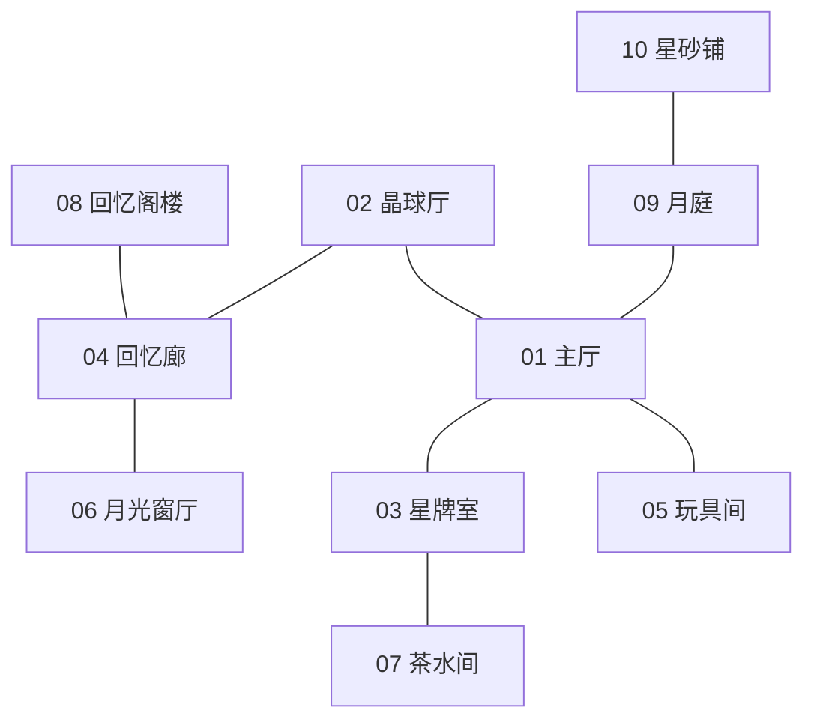

| 编号 | 房间 | 主色身份 | 连接证据 |
|---|---|---|---|
| 00 | 全馆剖面审核总览 | 全馆综合色谱 | 直接嵌入 01–10 成图，不做 AI 重画 |
| 01 | 主厅 | 蜂蜜橡木、雾青、琥珀 | 全馆材质与暖光锚点 |
| 02 | 晶球厅 | 珠光蓝、烟紫、浅水绿 | 右侧拱门接 01；蓝紫入口延续到 04 |
| 03 | 星牌室 | 森林绿、旧铜、酒红、靛蓝 | 左侧拱门接 01；绿毯与铜灯延续到 07 |
| 04 | 回忆廊 | 羊皮纸金、灰玫瑰、旧梅紫 | 左侧可见 02 晶球光；坡道去 06/08 |
| 05 | 玩具间 | 杏色、旧青绿、芥末黄、珊瑚 | 低门洞接 01 后侧支路 |
| 06 | 月光窗厅 | 月光蓝、暖奶油、淡薰衣草 | 左侧门洞保留 04 的灰玫瑰与金色 |
| 07 | 茶水间 | 鼠尾草绿、奶油陶、陶土红、旧铜 | 左门可见 03 的森林绿月纹 |
| 08 | 回忆阁楼 | 烟褐、靛蓝、旧梅紫、银月光 | 右下坡道/活板门回到 04 |
| 09 | 月庭 | 深钴蓝、蓝绿色、薰衣草、琥珀灯链 | 门内可见 01 暖光；小径继续到 10 |
| 10 | 星砂铺 | 褪色蓝、暖奶油、梅紫、星砂金 | 左侧花径和灯链承接 09 |

## 00 · 全馆剖面审核总览

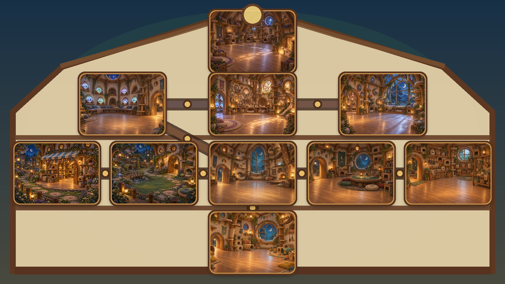

## 01 · 主厅（已通过锚点）

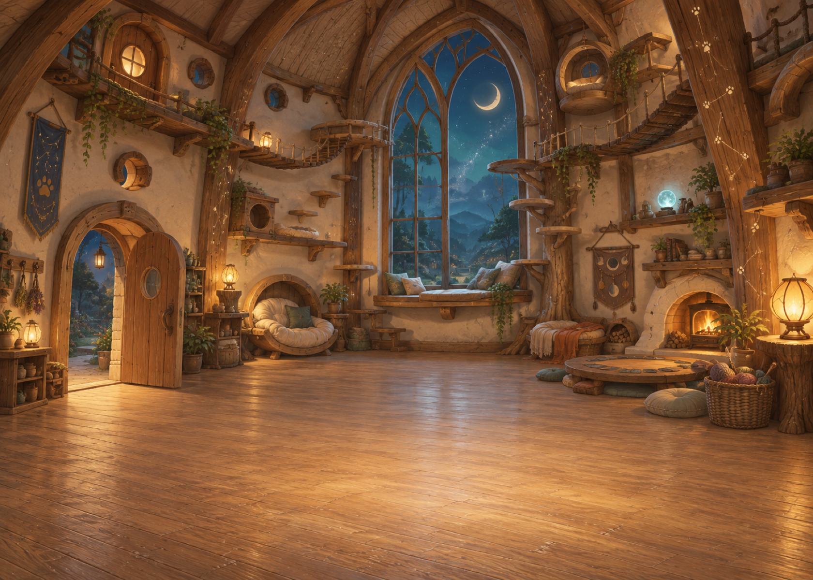

## 02 · 晶球厅

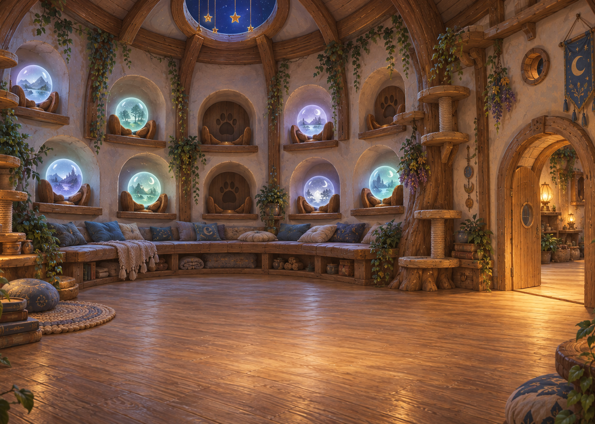

## 03 · 星牌室

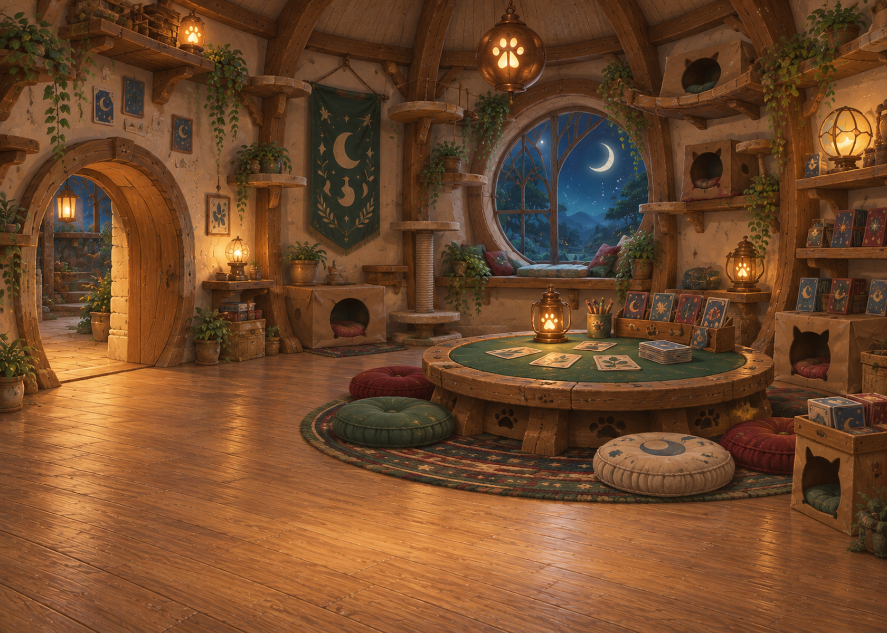

## 04 · 回忆廊

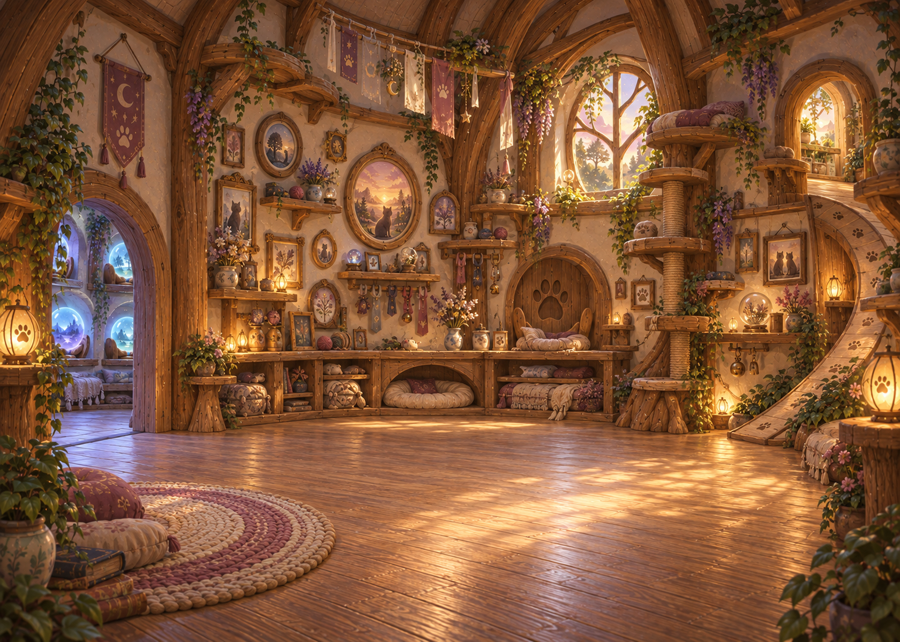

## 05 · 玩具间

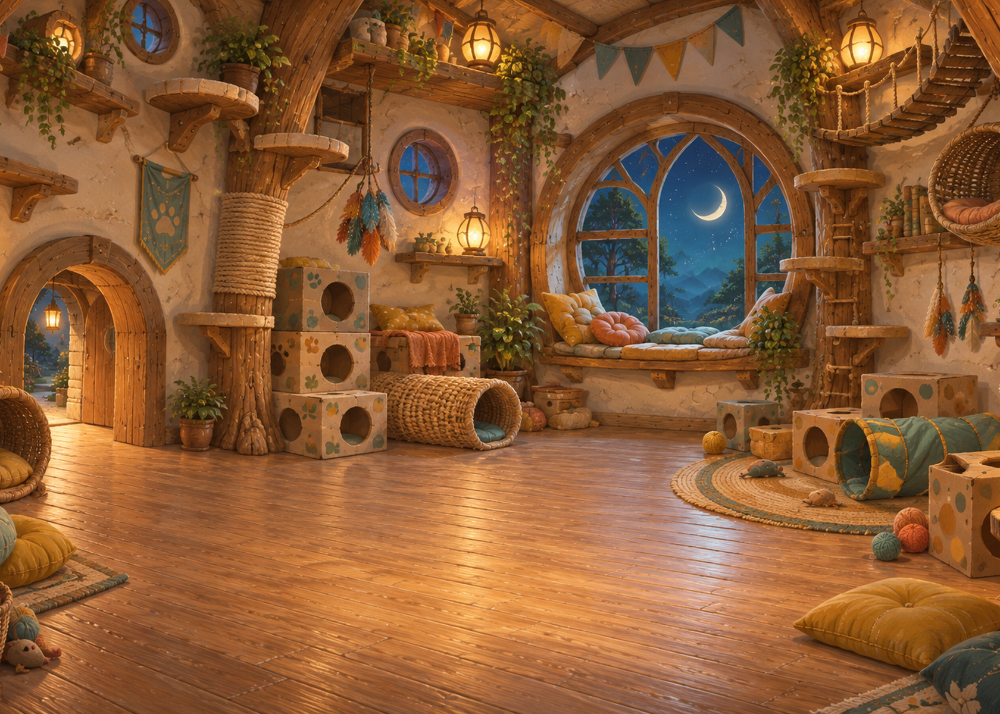

## 06 · 月光窗厅

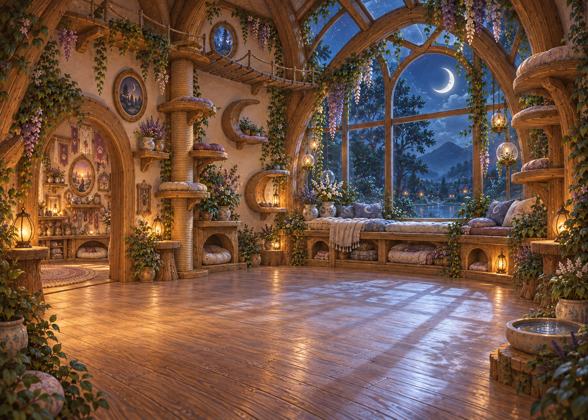

## 07 · 茶水间

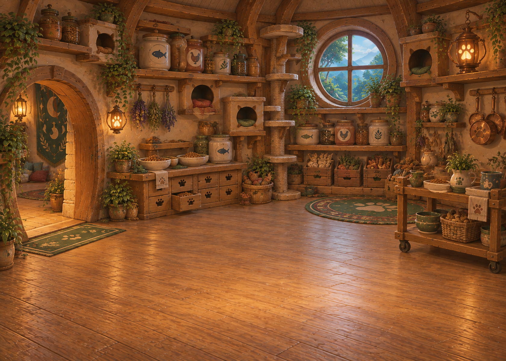

## 08 · 回忆阁楼

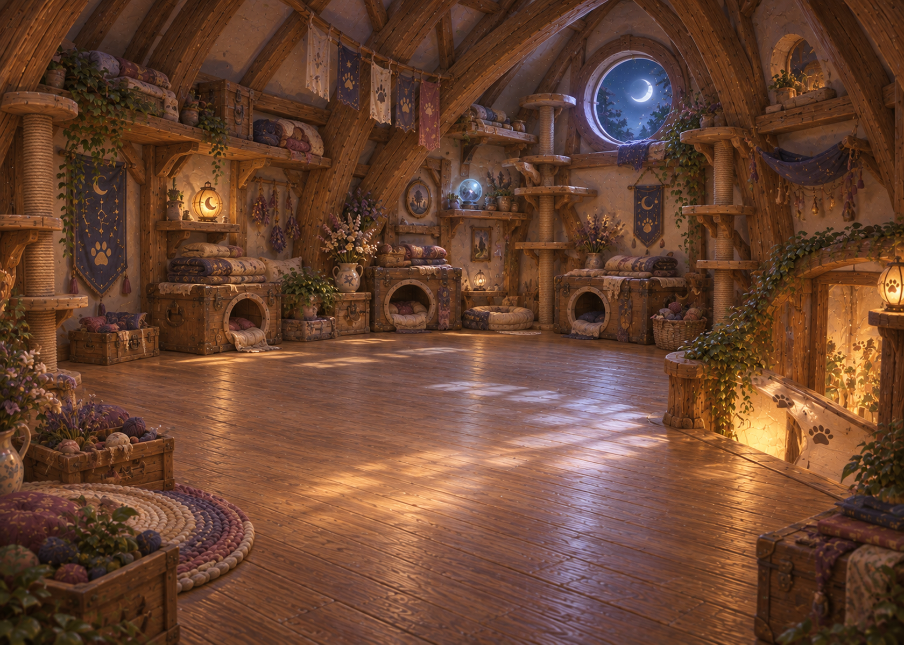

## 09 · 月庭

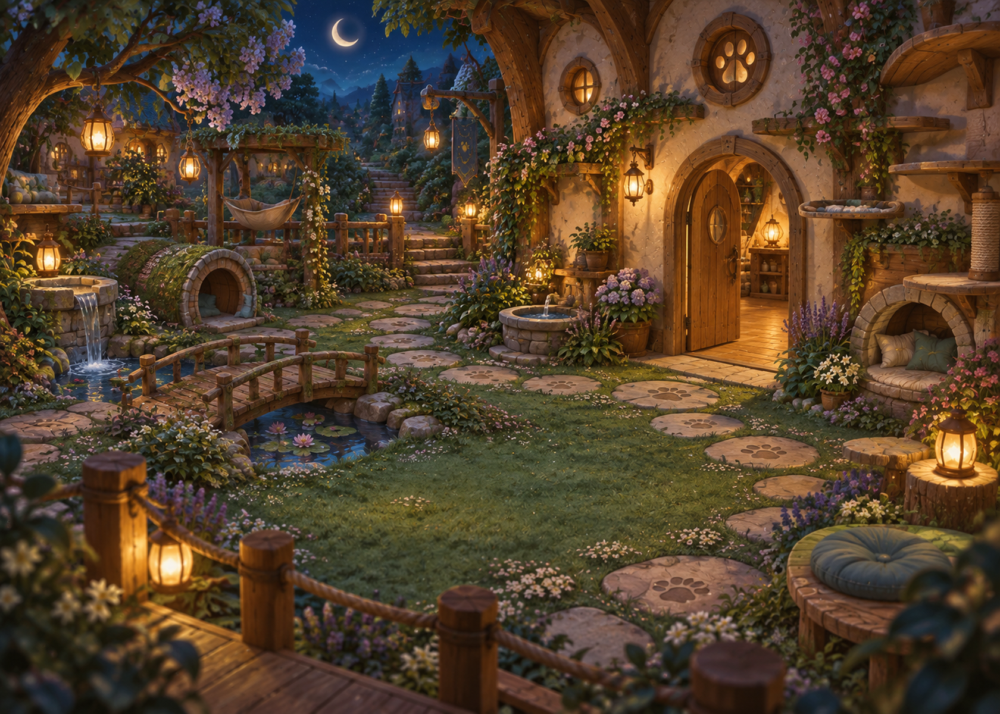

## 10 · 星砂铺

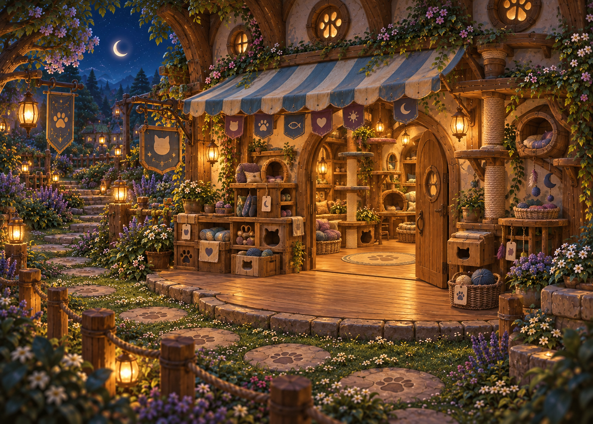
