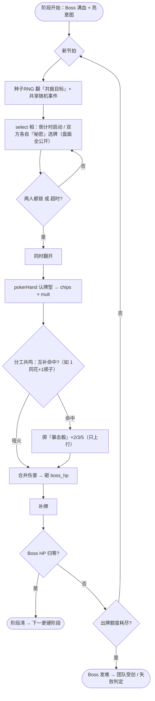
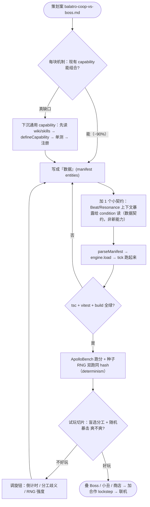
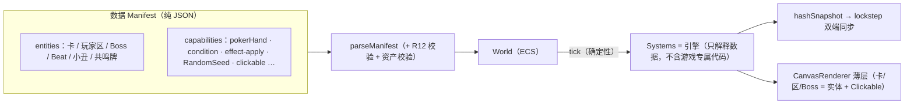

# 对垒小丑 · 合作 vs Boss —— 流程图（给 PE）

> Mermaid 图，GitHub / 支持 Mermaid 的 Markdown 里直接渲染成图。配套策划案：`balatro-coop-vs-boss.md`。

## 1. 玩法流程（一拍循环 = 核心玩法）

## 2. 开发流程（数据驱动 · 给实现）

## 3. 系统数据流（一眼看懂架构）

## 给 PE 的三条红线
1. **游戏 = 数据**：新牌种（Echo/Pact/Relay/…）是 **manifest 数据**，不是新 system；唯一引擎改动 = 第 2 图里那个"小契约"。
2. **随机必种子化**（同一 `RandomSeed` 源）→ 否则联机两端分叉。
3. **先验切片再扩**：先把"盲选分工 + 随机暴击"那一拍做出来试玩（第 1 图的循环 + 第 7 节数据清单），好玩了再叠 Boss/联机。
